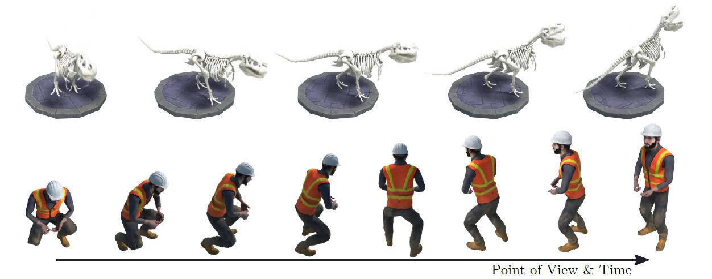
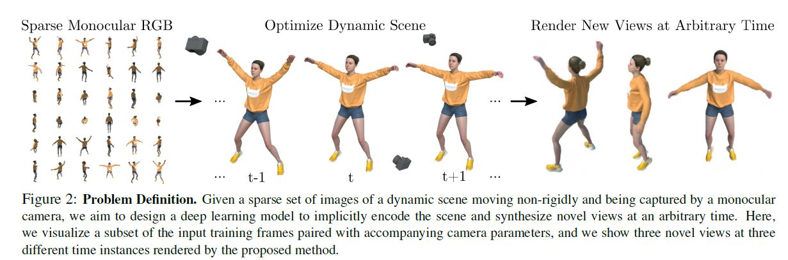
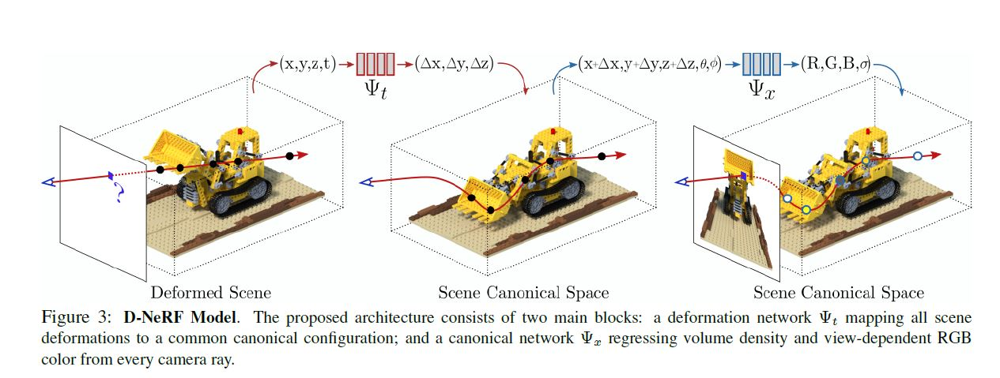
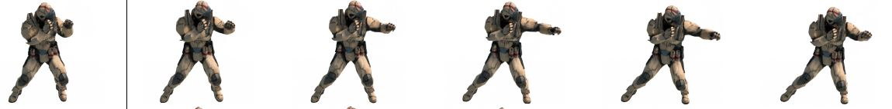

# D-NeRF: Neural Radiance Fields for Dynamic Scenes

大家好，今天给大家介绍Neural Rendering中NeRF的一个方向——deformable场景，也就是可形变场景的重建。这篇文章叫D-NeRF,文章的内容比较简单，并且实用性也不高。但是为了让大家更多的了解deformable场景重建这个方向，这里还是给大家简单介绍一下。

这篇文章是2020年的一篇文章，这里只是简单的做个介绍。主要从几张图来看这篇文章。

  
*** 

首先，正文的第一张图。

### **这张图说了什么内容呢？**

这张图是说，本文提出了D-NeRF的方法，这个方法能够针对包含复杂的非刚性几何体（物体）的场景进行新视角的合成，并且能够合成任意时间点的新视角。这里利用一组稀疏的单目图像就能优化一个underlying deformable volumetric function，并且不需要真实的几何和多视角图像。(什么意思呢？就是说D-NeRF的输入就是最简单的单目视频，不需要额外的mesh或立体视觉作为输入)。这张图展示了两个场景，都是时间点和视角可变的场景。

仔细看这张图，你会发现一个问题，这里用到的图像都是合成图像，并且是没有背景的。所以这里说是能解决动态可形变场景的重建其实有点言过其实了。因为采用的是合成图像，那么在利用NeRF类方法进行重建过程中，必须的相机位姿参数就比较容易获取了（因为是合成图像，所以位姿参数是已知的）。但在真实场景中，形变物体的位姿参数相对来说，比较难准确获取，具体怎么获取会在之后的文章中介绍。

所以看了这张图之后，我们就也能了解到本文的局限性了，很难具体应用到实际的生产实践当中，那么接下来就简单的介绍下本文的方法思路。

  
***
  

文章的第二张图，描述了本文的问题定义：给定一系列非刚性运动的动态场景的单目捕获的照片，目的是设计一个深度学习模型来对整个场景进行表征，并且能够合成任意时刻的新视角的照片。

  
***
  

## 方法部分

本文的方法部分如下面这张图所示：

 
D-NeRF模型的架构如上图所示，架构有两部分构成，deformation形变网络$\Psi_t$和canonical规范网络$\Psi_x$，所对应的分别是形变场景和规范场景。

其中规范网络$\Psi_x$和最初版本的NeRF相似，都是给定输入$(x,y,z,\theta,\phi)$经过$\Psi_x$（MLP）网络输出相应的$(r,g,b,\sigma)$值。

而形变网络则是将任意时刻（t时刻）的场景映射到规范场景，形变网络的输入是$(x,y,z,t)$，代表任意$t$时刻的空间位置$(x,y,z)$经过$\Psi_t$得到$(\Delta{x}, \Delta{y}, \Delta{z})$, $(\Delta{x}, \Delta{y}, \Delta{z})$是规范场景相对形变场景的偏移，因此$(x+\Delta{x}, y+\Delta{y}, z+\Delta{z})$就是$t$时刻形变空间位置$(x,y,z)$对应到规范空间的位置坐标。

有了t时刻空间位置$(x,y,z)$所对应的规范空间的坐标$(x+\Delta{x}, y+\Delta{y}, z+\Delta{z})$，再结合新视角的相机角度$(\theta, \phi)$，作为输入$(x+\Delta{x}, y+\Delta{y}, z+\Delta{z}, \theta, \phi)$经过规范网络$\Psi_x$就能得到对应的$(r,g,b,\sigma)$值。

有了$t$时刻任意位置的$(r,g,b,\sigma)$值后，就可以利用最初版本NeRF同样的Volume Rendering的方法将新视角的照片渲染出来了。

  

## 实现细节

1. 形变网络$\Psi_t$和规范网络$\Psi_x$都是8层的MLP，ReLU作为激活层，规范网络$\Psi_x$输出颜色$c$和密度$\sigma$的最后一层接的是`sigmoid`激活。
2. 训练过程中，输入400x400的图片，经过800k次迭代，每次迭代batch size为4096条光线，每条光线上采样64个点，采用Adam优化器。
3. 模型在1080的卡上训练了两天。

  
***
  

## 总结
这篇文章甚至没有写limitation的部分，这篇文章的实用性并不高，但是作为deformable类型NeRF的比较早期的文章，还是可以给我们带来很多的启发，比如构建一个规范场，讲非刚性变化当成是形变场相对于规范场的形变来进行处理。

这篇文章中存在着诸多的问题，这里就不细究了，如
* 在真实场景下，相机位姿如何获取？
* 场景中的每一点都是单独计算的，那么如何去区分，物体的某一部分向前运动和相机空间进行了缩放。如下图所示，如果图中的人向相机的方向出拳，如何区分拳头这个位置是发生了形变还是相机向拳头移近了？
