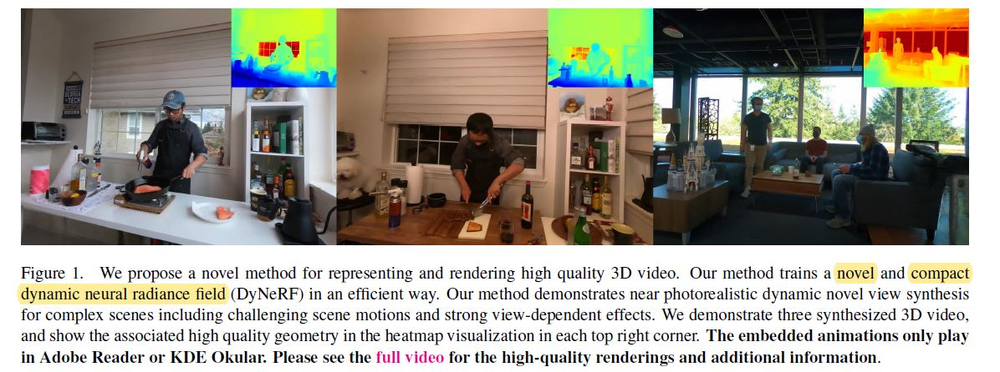

# [Neural 3D Video Synthesis from Multi-view Video](https://neural-3d-video.github.io/)

paper: [Neural 3D Video Synthesis from Multi-view Video](https://neural-3d-video.github.io/resources/paper.pdf)

  
## Abstract
 

  
## Introduction
 

> Dynamic realworld scenes are notoriously hard to model using classical mesh-based representations, since they often contain thin structures, semi-transparent objects, specular surfaces, and topology that constantly evolves over time due to the often complex scene motion of multiple objects and people.

> 众所周知，动态真实世界场景很难使用经典的基于网格的表示去进行建模，因为它们通常包含薄结构、半透明对象、镜面和拓扑，由于多个对象和人的场景运动通常很复杂，这些拓扑也会随着时间的推移而不断演变。

