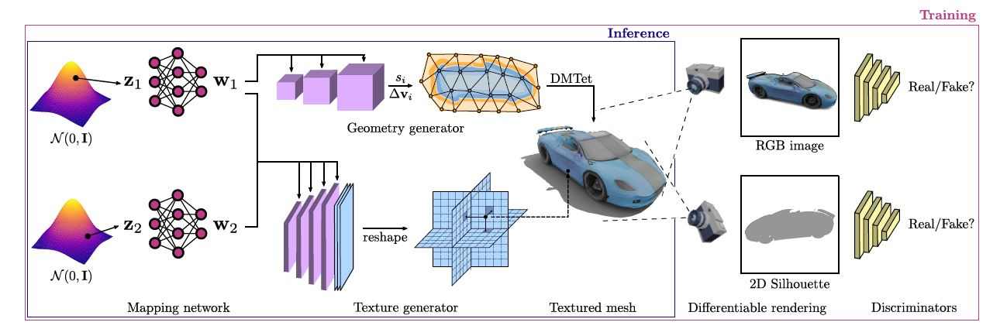

# GET3D

大家好今天来给大家讲解一篇文章Get 3D ，这篇文章的全称是 A generative model of High quality 3D textured shapes learned from images 。从图像中学习的高质量的带纹理的3D形状的生成模型，这篇文章是发表在NeurIPS 2022的一篇文章 。文章的作者主要来自英伟达团队 。

home page: [GET3D: A Generative Model of High Quality 3D Textured Shapes Learned from Images](https://nv-tlabs.github.io/GET3D/)

paper: [GET3D: A Generative Model of High Quality 3D Textured Shapes Learned from Images](https://nv-tlabs.github.io/GET3D/assets/paper.pdf)

  

## HOME PAGE
 

> We generate a 3D SDF and a texture field via two latent codes. We utilize DMTet to extract a 3D surface mesh from the SDF, and query the texture field at surface points to get colors. We train with adversarial losses defined on 2D images. In particular, we use a rasterization-based differentiable renderer to obtain RGB images and silhouettes. We utilize two 2D discriminators, each on RGB image, and silhouette, respectively, to classify whether the inputs are real or fake. The whole model is end-to-end trainable.

这张图是文章的整体的架构图，从图中可以看到：
* GET3D有两个输入$z_1$和$z_2$，这是两个隐式编码，$z_1$是对物体的几何形状进行编码，$z_2$是对物体的表面纹理进行编码。举例来说明一下，假设我们现在要去生成一只动物，那么$z_1$去编码物体的几何，意味着我们可以通过调节$z_1$，来调整动物的大小、形状、耳朵长短、眼睛大小、鼻子长短等；$z_2$去编码表面纹理，意味着我们可以通过调节$z_2$来调节动物的表征，如一匹马的颜色等；
* GET3D利用`DMTet`网络从SDF场中将物体的3D表面mesh提取出来，将表面上的点输入纹理场`texture field`查询相应的颜色值；
* GET3D使用了基于光栅化的前向可微渲染器，分别生成了RGB图像和轮廓图；针对这两张生成图像，GET3D采用了两个判别器去对生成的结果进行判别；
* 这个模型是一个端到端的系统，可以进行端到端的训练；

  

<video width="720" height="303" controls>
<source src="https://nv-tlabs.github.io/GET3D/assets/teaser-rotate.mp4" type="video/mp4">
</video>

 

> GET3D is able to generate diverse shapes with arbitrary topology, high-quality geometry and texture.

GET3D 能够生成具有任意拓扑、高质量几何和纹理的各种形状。

这里展示了不同数据类型的生成，从上到下，分别是车、椅子、动物、摩托车、人、建筑物。

  

<video width="720" height="303" controls>
<source src="https://nv-tlabs.github.io/GET3D/assets/six-category-1x1.mp4" type="video/mp4">
</video>

 

<video width="720" height="303" controls>
<source src="https://nv-tlabs.github.io/GET3D/assets/full-scene-slide-1x1.mp4" type="video/mp4">
</video>

 

> Qualitative results on unconditional 3D generation. We highlight the diversity and quality of our generated 3D meshes with textures, including: 1. wheels on the legs of the chairs; 2. wheels, all the lights and windows for the cars; 3. mouth, ears, horns for the animals; 4. back mirrors, wireframes on the tires for the motorbike, 5. the high-heeled shoes, cloths for humans

上图是GET3D生成结果的定性展示。我们可以重点去看生成的带有纹理的3D mesh的质量和种类的多样性，包括：
1. 椅子腿上的轮子； 
2. 汽车的车轮、灯和车窗； 
3. 动物的嘴巴、耳朵、角； 
4. 摩托车的后视镜和轮胎上的条纹；
5. 人的高跟鞋和衣服；

 

### Disentanglement between Geometry and Texture
 

<video width="720" height="303" controls>
<source src="https://nv-tlabs.github.io/GET3D/assets/combined_car_swap.mp4" type="video/mp4">
</video>

 

> In each row, we show shapes generated from the same geometry latent code, while changing the texture latent code. In each column, we show shapes generated from the same texture latent code, while changing the geometry code. Our model achieves a good disentanglement between geometry and texture.

  
## Abstract

> As several industries are moving towards modeling massive 3D virtual worlds, the need for content creation tools that can scale in terms of the quantity, quality, and diversity of 3D content is becoming evident. In our work, we aim to train performant 3D generative models that synthesize textured meshes which can be directly consumed by 3D rendering engines, thus immediately usable in downstream applications. Prior works on 3D generative modeling either lack geometric details, are limited in the mesh topology they can produce, typically do not support textures, or utilize neural renderers in the synthesis process, which makes their use in common 3D software non-trivial. In this work, we introduce GET3D, a Generative model that directly generates Explicit Textured 3D meshes with complex topology, rich geometric details, and high fidelity textures. We bridge recent success in the differentiable surface modeling, differentiable rendering as well as 2D Generative Adversarial Networks to train our model from 2D image collections. GET3D is able to generate high-quality 3D textured meshes, ranging from cars, chairs, animals, motorbikes and human characters to buildings, achieving significant improvements over previous methods.

> 随着多个行业朝着对大型 3D 虚拟世界建模的方向发展，对能够根据 3D 内容的数量、质量和多样性进行扩展的内容创建工具的需求变得越来越旺盛。

> 在我们的工作中，我们的目标是去训练 能够合成带有纹理的网格的高性能3D生成模型，这些带纹理的网格mesh可以直接被 3D 渲染引擎使用，因此可以立即用于下游应用程序。

> 先前关于 3D 生成建模的工作要么受限于它们可以生成的网格拓扑通常不支持纹理而缺乏几何细节，要么在合成过程中使用神经渲染器，这使得它们在通常的 3D 软件中的使用变得更加复杂。

> 在这项工作中，我们介绍了 GET3D，这是一种生成模型，可直接生成具有复杂拓扑、丰富几何细节和高保真纹理的 Explicit Textured 3D Mesh。

> 我们将最近在可微表面建模、可微渲染以及 2D 生成对抗网络方面的成功结合起来，从 2D 图像集合中训练我们的模型。 GET3D 能够生成高质量的 3D 纹理网格( textured meshes)，可生成的种类范围从汽车、椅子、动物、摩托车和人物角色到建筑物，与以前的方法相比取得了显着改进。

  
## Introduction
 

> In this work, we introduce a novel approach that aims to tackle all the requirements of a practically useful 3D generative model. Specifically, we propose GET3D, a Generative model for 3D shapes that directly outputs Explicit Textured 3D meshes with high geometric and texture detail and arbitrary mesh topology. In the heart of our approach is a generative process that utilizes a differentiable explicit surface extraction method [60] and a differentiable rendering technique [47, 37]. The former enables us to directly optimize and output textured 3D meshes with arbitrary topology, while the latter allows us to train our model with 2D images, thus leveraging powerful and mature discriminators developed for 2D image synthesis. Since our model directly generates meshes and uses a highly efficient (differentiable) graphics renderer, we can easily scale up our model to train with image resolution as high as 1024 × 1024, allowing us to learn high quality geometric and texture details.

> 在这项工作中，我们介绍了一种新颖的方法，旨在解决实际有用的3D生成模型的所有要求。 具体来说，我们提出了GET3D，这是一种3D形状的生成模型，它直接输出具有高几何和纹理细节以及任意网格拓扑的显式的带纹理的3D网格。 我们方法的核心是利用可微显式表面提取方法和可微渲染技术的生成过程。 前者使我们能够直接优化和输出具有任意拓扑的带纹理的3D网格，而后者使我们能够用2D图像训练我们的模型，从而利用为2D图像合成开发的强大而成熟的鉴别器。由于我们的模型直接生成网格并使用高效（可微分）图形渲染器，我们可以轻松扩展模型以训练高达 1024 × 1024 的图像分辨率，从而学习高质量的几何和纹理细节。

  

*** 

## Related Work

 

### 3D Generative Models

这一部分提出了之前生成类方法的局限：
* 将 2D CNN 生成器直接扩展到 3D 体素网格，但是 3D 卷积的高内存占用和计算复杂性阻碍了高分辨率的生成过程。
* 点云、隐式或八叉树表示，这些方法主要集中在生成几何图形而忽略了外观。 它们的输出表示也需要进行后处理，以使其与标准图形引擎兼容。
* Textured3DGAN 和 DIBR 生成带纹理的 3D 网格，但它们将生成公式化为模板网格的变形，这阻碍了它们生成复杂的拓扑结构或具有不同属的形状，而我们的方法可以做到这一点。
* PolyGen 和 SurfGen 可以生成具有任意拓扑的网格，但不能合成纹理。

 

### 3D-Aware Generative Image Synthesis

这一部分列举了之前带有3D一致的生成式图像合成方法的局限：
* 神经体绘制网络通常查询速度很慢，导致训练时间长，并生成分辨率有限的图像。
*  GIRAFFE 和 StyleNerf 通过以较低分辨率执行神经渲染，然后使用 2D CNN 对结果进行上采样，提高了训练和渲染效率。 然而，性能提升是以降低多视图一致性为代价的。
*  EG3D 可以部分缓解这个问题。 然而，从基于神经渲染的方法中提取纹理表面并非易事。
*  相比之下，GET3D 直接输出可在标准图形引擎中轻松使用的纹理 3D 网格。

  
## Method

方法部分的总体结构如下所示：

* Generative Model of 3D Textured Meshes
  * Geometry Generator
    * Network Architecture
    * Differentiable Mesh Extraction
  * Texture Generator
    * Network Architecture
* Differentiable Rendering and Training
  * Differentiable Rendering
  * Discriminator & Objective
  * Regularization

### Generative Model of 3D Textured Meshes

  
### 讲解视频

[[Neural Rendering: GAN]——GET3D论文讲解](https://www.bilibili.com/video/BV1te4y1i7KF/?spm_id_from=333.999.0.0&vd_source=2ef7e92f2d522c31939f486aea77a19e)

