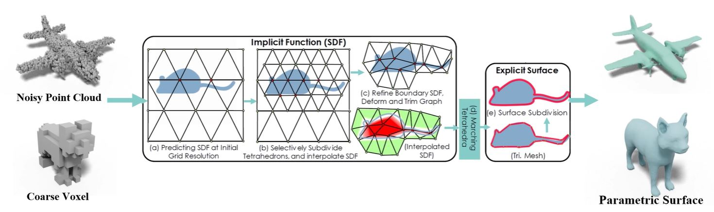

# DMTet

home page: [GET3D: A Generative Model of High Quality 3D Textured Shapes Learned from Images](https://nv-tlabs.github.io/GET3D/)

paper: [Deep Marching Tetrahedra: a Hybrid Representation for High-Resolution 3D Shape Synthesis](https://nv-tlabs.github.io/DMTet/assets/dmtet.pdf)

github: 

## Home Page

### Abstract

> We introduce DMTet, a deep 3D conditional generative model that can synthesize high-resolution 3D shapes using simple user guides such as coarse voxels. It marries the merits of implicit and explicit 3D representations by leveraging a novel hybrid 3D representation. Compared to the current implicit approaches, which are trained to regress the signed distance values, DMTet directly optimizes for the reconstructed surface, which enables us to synthesize finer geometric details with fewer artifacts. Unlike deep 3D generative models that directly generate explicit representations such as meshes, our model can synthesize shapes with arbitrary topology. The core of DMTet includes a deformable tetrahedral grid that encodes a discretized signed distance function and a differentiable marching tetrahedra layer that converts the implicit signed distance representation to the explicit surface mesh representation. This combination allows joint optimization of the surface geometry and topology as well as generation of the hierarchy of subdivisions using reconstruction and adversarial losses defined explicitly on the surface mesh. Our approach significantly outperforms existing work on conditional shape synthesis from coarse voxel inputs, trained on a dataset of complex 3D animal shapes. Project page: https://nv-tlabs.github.io/DMTet/.

DMTet的全称是Deep Marching Tetrahedral，它是一种深度3d条件生成模型，它可以仅使用简单的用户指导就能生成高分辨率的3D形状，这种简单的用户指导，打个比方，可以是粗略的3D体素也可以是带有噪声的点云，我们可以看图中的输入部分。

DMTet利用一种新的混合3D呈现方式，能够结合隐式和显式3D呈现的优点；

当前的隐式呈现方法，大多是去回归得到一个sdf值，那相较于这些方法，DMTet直接对重建表面进行优化，这使得DMTet能够合成更精细的几何细节，同时伪影也会更少；

与直接生成网格（Mesh）等显式表示的深度3D生成模型又不同，DMTet可以合成具有任意拓扑的形状; 比如可以生成有洞的这种拓扑形状；

DMTet的核心包括一个可形变的四面体网格和一个可微的marching tetrahedra层，四面体网格的每一个顶点都编码了一个sdf值，而marching tetrahedra层能够将隐式的sdf呈现转换为显示表面mesh呈现；

DMTet的这种组合方式，允许对表面几何、拓扑结构以及细分层次的生成进行联合优化，优化过程中的目标函数是使用在表面网格上显式定义的reconstruction loss和adversarial loss；

并且DMTet的方法，在当时是明显优于同类算法的。

  

### Method

 

### 视频讲解

