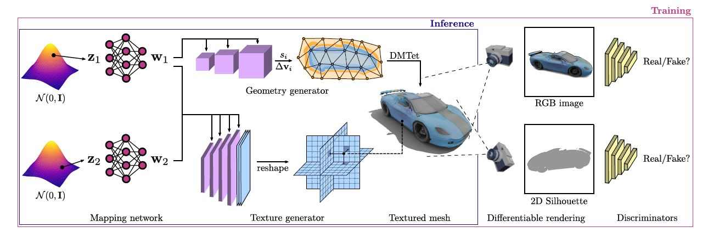

# GET3D 

home page: [GET3D: A Generative Model of High Quality 3D Textured Shapes Learned from Images](https://nv-tlabs.github.io/GET3D/)

paper: [GET3D: A Generative Model of High Quality 3D Textured Shapes Learned from Images](https://nv-tlabs.github.io/GET3D/assets/paper.pdf)

  

## HOME PAGE
 

> We generate a 3D SDF and a texture field via two latent codes. We utilize DMTet to extract a 3D surface mesh from the SDF, and query the texture field at surface points to get colors. We train with adversarial losses defined on 2D images. In particular, we use a rasterization-based differentiable renderer to obtain RGB images and silhouettes. We utilize two 2D discriminators, each on RGB image, and silhouette, respectively, to classify whether the inputs are real or fake. The whole model is end-to-end trainable.

这张图是文章的整体的架构图，从图中可以看到：
* GET3D有两个输入$z_1$和$z_2$，这是两个隐式编码，$z_1$是对物体的几何形状进行编码，$z_2$是对物体的表面纹理进行编码。举例来说明一下，假设我们现在要去生成一只动物，那么$z_1$去编码物体的几何，意味着我们可以通过调节$z_1$，来调整动物的大小、形状、耳朵长短、眼睛大小、鼻子长短等；$z_2$去编码表面纹理，意味着我们可以通过调节$z_2$来调节动物的表征，如一匹马的颜色等；
* GET3D利用`DMTet`网络从SDF场中将物体的3D表面mesh提取出来，将表面上的点输入纹理场`texture field`查询相应的颜色值；
* GET3D使用了基于光栅化的前向可微渲染器，分别生成了RGB图像和轮廓图；针对这两张生成图像，GET3D采用了两个判别器去对生成的结果进行判别；
* 这个模型是一个端到端的系统，可以进行端到端的训练；

  

<video width="720" height="303" controls>
<source src="https://nv-tlabs.github.io/GET3D/assets/teaser-rotate.mp4" type="video/mp4">
</video>

 

> GET3D is able to generate diverse shapes with arbitrary topology, high-quality geometry and texture.

GET3D 能够生成具有任意拓扑、高质量几何和纹理的各种形状。

这里展示了不同数据类型的生成，从上到下，分别是车、椅子、动物、摩托车、人、建筑物。

  

<video width="720" height="303" controls>
<source src="https://nv-tlabs.github.io/GET3D/assets/six-category-1x1.mp4" type="video/mp4">
</video>

 

<video width="720" height="303" controls>
<source src="https://nv-tlabs.github.io/GET3D/assets/full-scene-slide-1x1.mp4" type="video/mp4">
</video>

 

> Qualitative results on unconditional 3D generation. We highlight the diversity and quality of our generated 3D meshes with textures, including: 1. wheels on the legs of the chairs; 2. wheels, all the lights and windows for the cars; 3. mouth, ears, horns for the animals; 4. back mirrors, wireframes on the tires for the motorbike, 5. the high-heeled shoes, cloths for humans

上图是GET3D生成结果的定性展示。我们可以重点去看生成的带有纹理的3D mesh的质量和种类的多样性，包括：
1. 椅子腿上的轮子； 
2. 汽车的车轮、灯和车窗； 
3. 动物的嘴巴、耳朵、角； 
4. 摩托车的后视镜和轮胎上的条纹；
5. 人的高跟鞋和衣服；

 

### Disentanglement between Geometry and Texture
 

<video width="720" height="303" controls>
<source src="https://nv-tlabs.github.io/GET3D/assets/combined_car_swap.mp4" type="video/mp4">
</video>

 

<>
