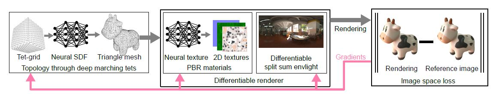

## 方法部分

本文提出了一种3D重建的方法，这个方法需要几个输入：
1. 多视角的图片，并且图片的光照条件是未知的；
2. 每张图片对应的相机位姿参数；
3. 前景、背景分割的mask

nvdiffrec会产出如下三项内容：那三项呢？
1. triangle meshes, 也就是重建物体的mesh或形状、轮廓；
2. spatially-varying materials，材质；材质存储到纹理中；
3. lighting，可以是一张HDR的环境光纹理，类似光照探针（probe）的概念

  

具体，本文结合DMTet去联合对形状、材质和光照进行优化。这里有几个要素：
1. 参数化的四面体网格，网格的每个顶点定义了一个sdf值和一个偏移量，通过一个marching tetrahedra layer，可以将物体的表面mesh提取出来；
2. 拓扑的优化；
3. shading模型；

  

### Learning Topology

这里先说明了NeRF类算法，提取表面mesh的问题。

在每一个优化步骤中，DMTet显示通过MT（marching tetrahedra）的方法提取出三角表面网格，然后通过一个可微的光栅化渲染器，得到输出图像。

SDF值可以作为一个先验输入，如果我们有一个比较好的sdf初始输入，那么会大大提升整体结果的细节以及训练速度。

在这个过程中，为了产生物体形状之外的漂浮的形状、或是在物体内部的形状，这里会加上一项正则化的限制。

这个正则项