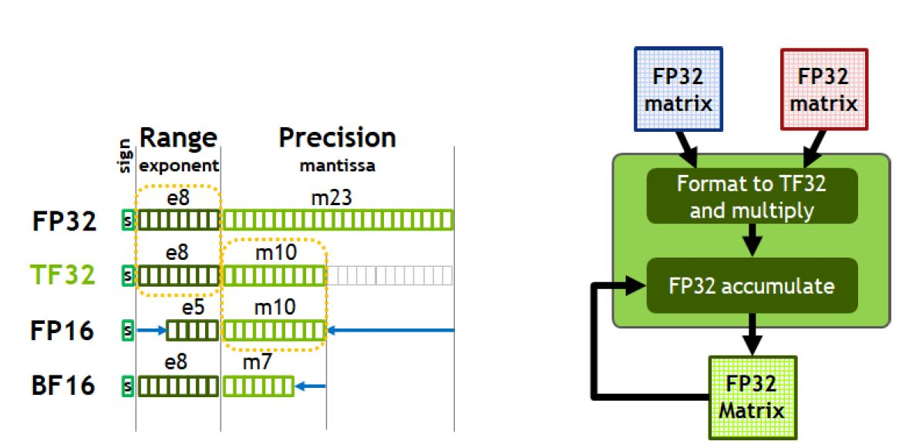
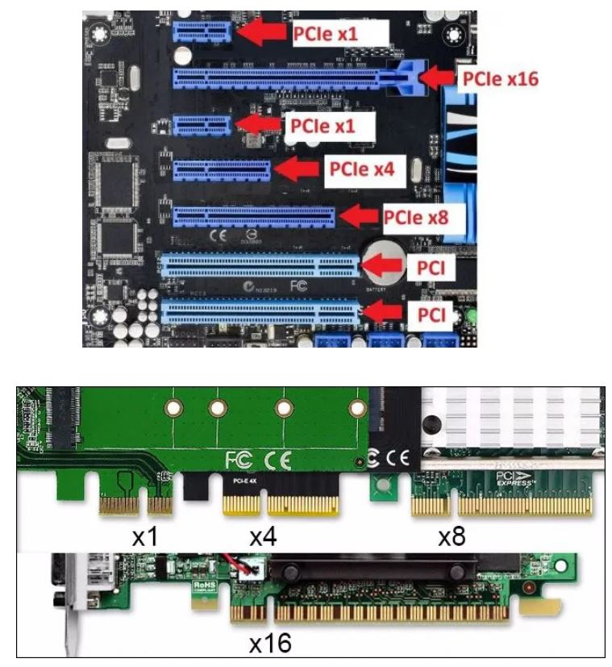
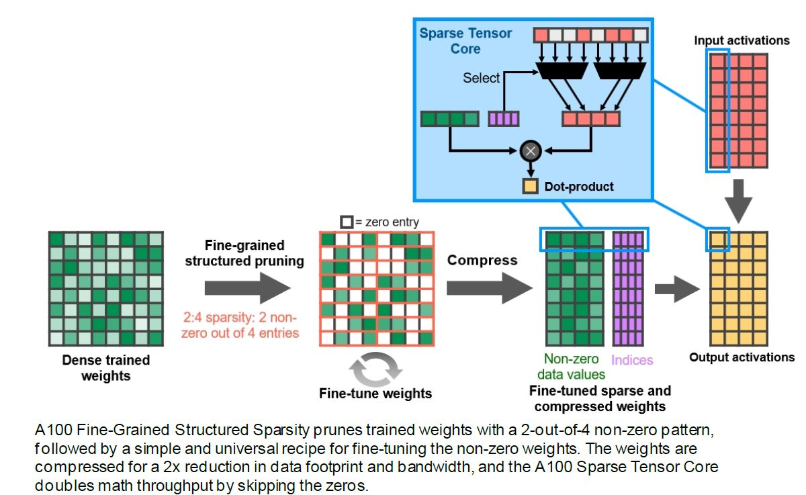

## Introduction

在现代云数据中心运行的计算密集型应用程序的多样性推动了 NVIDIA GPU 加速云计算的爆炸式增长。 此类密集型应用包括 AI 深度学习训练和推理、数据分析、科学计算、基因组学、边缘视频分析和 5G 服务、图形渲染、云游戏等等。 从扩展 AI 训练和科学计算，到扩展推理应用程序，再到启用实时对话式 AI，NVIDIA GPU 提供了必要的马力来加速在当今云数据中心运行的众多复杂且不可预测的工作负载。

  
## 常见问题

 

* BF16是什么数据格式？
  * [BF16格式数据](https://blog.csdn.net/sunmingyang1987/article/details/115362809)
    * BF16的指数位比FP16多，跟FP32一样，不过小数位比较少。这样设计说明了设计者希望在16bits的空间中，通过降低精度（比FP16的精度还低）的方式，来获得更大的数值空间（Dynamic Range）
    * 这种数据格式就是BF16，使用BF16算法的预测精度与FP32相似，但不如FP32精确（谷歌曾说过，这是因为神经网络对指数的大小比尾数敏感得多）。对于大多数应用程序，尤其是计算机视觉和语音方面，这种折衷是可以接受的
  * [BF16是为深度学习而优化的新数字格式 预测精度的降低幅度最小](https://blog.csdn.net/yaoyutian/article/details/114458750)
    * BF16，有时也被称为BFloat16或Brain Float16，是一种针对人工智能／深度学习应用程序进行优化的新数字格式。它在谷歌Brain上获得了广泛的应用，包括谷歌、英特尔、Arm和许多其他公司的人工智能加速器。
    * BF16背后的想法是通过降低数字的精度来减少计算能力和将张量相乘所需的能源消耗。张量是一个三维的数字矩阵；张量的乘法是计算人工智能所需的关键数学运算。
    * 现在大多数人工智能训练都使用FP32， 32位浮点数。虽然这意味着计算非常准确，但它需要强大的硬件和大量的电力。推理通常使用INT8， 8位整数（整数）。虽然使用诸如INT8这样的较低精度的数字系统可以在相同的硬件上提供更高的吞吐量，从而节省电力，但是计算（预测）的结果却不那么准确。
    * BF16的目的是优化精度和预测精度之间的权衡，以增加吞吐量。
  * [bfloat16 数值格式](https://cloud.google.com/tpu/docs/bfloat16?hl=zh-cn)
    * 使用降低精确率的浮点数是一种缩短收敛时间而不会损失准确率的常用方法。TPU 在执行矩阵运算时使用 bfloat16 数字格式。矩阵乘法运算是针对 bfloat16 值执行，而累积是针对 IEEE float32 值执行。
  * bfloat16与fp32能够表征一样的范围（指数位数相同），精度会略有下降（位数7vs23）,但在视觉和语音方面，神经网络对指数的大小比尾数敏感的多。
    * 

 

* Fine grained structured sparsity是什么 ?
  * [细粒度结构化稀疏剪枝(Fine-grained Structural Sparse Pruning)](https://zhuanlan.zhihu.com/p/381279197)

 

* PCIE 3.0 * 16 是什么意思？
  * [请问PCIe 3.0 x 16（x4）是什么意思？](https://www.zhihu.com/question/391716892)
    * PCIe 3.0*16（*4）是指那个插槽是全长槽（*16长度），但有效带宽只有*4长度。
    * 物理接口尺寸全长（x16）,其实只有x4的布线，也就是无论接什么硬件上限都是x4
    * 
  
 

* ddr4 gddr6 hbm2的区别是什么?
  * [GDDR6 vs DDR4 vs HBM2?为什么CPU还不用GDDR？异构内存的未来在哪里？](https://zhuanlan.zhihu.com/p/83935084)
    * 如果引入HBM在内存系统中，加上DIMM类型的傲腾内存，我们就可能有三种内存共存的情况，每种内存都有自己的好处：HBM快，但是少；DDR内存多些，居中；傲腾内存最慢，但是容量大，而且内容不会丢失。三种内存可以形成互相cache的关系，也可以都报告给操作系统，让操作系统根据它们的特性和任务的特性，来主动选择具体存在哪里。如此，就形成了异构内存系统，这是内存发展的方向。

 

* tensor core是什么？
  * [深入理解混合精度训练：从 Tensor Core 到 CUDA 编程](https://aijishu.com/a/1060000000286803)
    * 混合精度是指在底层硬件算子层面，使用半精度（FP16）作为输入和输出，使用全精度（FP32）进行中间结果计算从而不损失过多精度的技术，而不是网络层面既有 FP16 又有 FP32。这个底层硬件层面其实指的就是 Tensor Core，所以 GPU 上有 Tensor Core 是使用混合精度训练加速的必要条件。
  * [NVIDIA深度学习Tensor Core性能解析（上）](https://wujianming110117.blog.csdn.net/article/details/106442850?spm=1001.2101.3001.6650.1&utm_medium=distribute.pc_relevant.none-task-blog-2%7Edefault%7ECTRLIST%7ERate-1-106442850-blog-106442372.pc_relevant_3mothn_strategy_recovery&depth_1-utm_source=distribute.pc_relevant.none-task-blog-2%7Edefault%7ECTRLIST%7ERate-1-106442850-blog-106442372.pc_relevant_3mothn_strategy_recovery&utm_relevant_index=2)
    * 首先进行的是GEMM测试，利用某些深度学习应用程序（DeepSpeech、Speaker ID和Language Modeling）中的内核进行GEMM操作，测出的性能比在cuBLAS中运行纯矩阵-矩阵乘法更有代表性。
    * 测试的结果在意料之内，启用Tensor Core可以大幅提升性能。深入研究细节可以发现，Tensor Core对于特定类型的矩阵-矩阵乘法会有特别的影响。
  * [Tensor Core技术解析（下）](https://blog.csdn.net/wujianing_110117/article/details/106442372)
    * 并没太看懂其中的内容

 

* tf32 vs fp32
  * [TensorFloat-32 in the A100 GPU Accelerates AI Training, HPC up to 20x](https://blogs.nvidia.com/blog/2020/05/14/tensorfloat-32-precision-format/)
    * TF32 running on Tensor Cores in A100 GPUs can provide up to 10x speedups compared to single-precision floating-point math (FP32) on Volta GPUs.
    * Combining TF32 with structured sparsity on the A100 enables performance gains over Volta of up to 20x.
    * Math formats are like rulers. The number of bits in a format’s exponent determines its range, how large an object it can measure. Its precision — how fine the lines are on the ruler — comes from the number of bits used for its mantissa, the part of a floating point number after the radix or decimal point.
    * A good format strikes a balance. It should use enough bits to deliver precision without using so many it slows processing and bloats memory.
    * TF32 uses the same 10-bit mantissa as the half-precision (FP16) math, shown to have more than sufficient margin for the precision requirements of AI workloads. And TF32 adopts the same 8-bit exponent as FP32 so it can support the same numeric range.
    * The combination makes TF32 a great alternative to FP32 for crunching through single-precision math, specifically the massive multiply-accumulate functions at the heart of deep learning and many HPC apps.
    * 
    * HPC apps called linear solvers — algorithms with repetitive matrix-math calculations — also will benefit from TF32. They’re used in a wide range of fields such as earth science, fluid dynamics, healthcare, material science and nuclear energy as well as oil and gas exploration.
  * [Using Tensor Cores for Mixed-Precision Scientific Computing](https://developer.nvidia.com/blog/tensor-cores-mixed-precision-scientific-computing/)
  * [How Sparsity Adds Umph to AI Inference](https://blogs.nvidia.com/blog/2020/05/14/sparsity-ai-inference/)
  * [What’s the Difference Between Single-, Double-, Multi- and Mixed-Precision Computing?](https://blogs.nvidia.com/blog/2019/11/15/whats-the-difference-between-single-double-multi-and-mixed-precision-computing/)
  * 

 

* Fine grained structured sparsity  是什么?
  * [细粒度结构化稀疏剪枝(Fine-grained Structural Sparse Pruning)](https://zhuanlan.zhihu.com/p/381279197)
    * 以Nvidia A100 GPU为例子，通过新的2：4稀疏矩阵，即每4个连续权重中允许两个非零值。由于矩阵的定义明确，一来可以对其进行有效压缩，将内存存储量和带宽减少近2倍。二来因为保存了非零值权重索引，所以只需要计算非零值的乘累加，计算速度加倍。
    * 如下图，Sparse Tensor Core通过indices挑选对应的acts与weights进行乘累加运算，实现计算加速。
    * 

  

* GPU的缓存机制？
  * [Understanding GPU caches](https://www.rastergrid.com/blog/gpu-tech/2021/01/understanding-gpu-caches/)
  * 

 

* Magnum IO是什么？
  * [NVIDIA Magnum IO——数据中心 IO 加速平台](https://www.nvidia.cn/data-center/magnum-io/)
    * 加速计算将计算速度提高了百万倍，使数据中心逐步演变为 AI 工厂。然而，加速计算需要加速 IO。NVIDIA Magnum IO™ 架构为并行智能数据中心 IO 而设计。该架构最大限度地提升存储、网络、多节点和多GPU通讯性能，为大型语言模型、推荐系统、成像、仿真和科学研究等全球重要的应用优化实现加速。

 

* Ampere架构中的Task Graph是什么？
  * [英伟达A100 Tensor Core GPU架构深度讲解](https://blog.51cto.com/u_15726357/5734490)
    * CUDA Task graph为向GPU提交工作提供了一个更有效的模型。Task graph由一系列操作组成，如内存拷贝和内核启动，这些操作通过依赖关系连接起来。Task graph允许定义一次并重复运行执行流。预定义的Task graph允许在单个操作中启动任意数量的内核，极大地提高了应用程序的效率和性能。A100增加了新的硬件特性，使Task graph中网格之间的路径明显更快。
    * 这篇blog中对每一项新特性都简短的进行了描述，可以作为ppt的备注参考

 

* DMMA是什么？
  * [双精度张量内核加快了高性能计算](https://www.cnblogs.com/wujianming-110117/p/14211200.html)
    * 用户可以调用新的CUDA-X库来访问A100中的FP64加速。这些GPU内置了支持DMMA的第三代Tensor内核，DMMA是一种新模式，可加速双精度矩阵乘法累加运算。
    * 单个DMMA作业使用一条计算机指令来代替八条传统的FP64指令。结果，A100的FP64数学运算速度比其它芯片更快，工作量更少，不仅节省了时间和功耗，而且还节省了宝贵的内存和I / O带宽。

 

* Transformer Engine
  * [简单读读TransformerEngine](https://zhuanlan.zhihu.com/p/576002611)
    * 这其实就是PyTorch的一个拓展，为了利用FP8的特性，针对Transformer里面的Kernel进行了重写，包含了一系列LayerNorm, GeLU, ScaledSoftmax等。
    * 使用方式也是比较简单，使用该拓展额外包的一层Module来搭建网络，即可，最后再包一层混合精度训练作用域
    * 在FP16下，其数据范围还是足够大的，因此在AMP下，我们只在最后的Loss做了一个scaling，这个步骤足以保证在整个模型运算过程中不会产生溢出
    * 而FP8相比FP16减少了更多有效位，因此不能简单地复用FP16下的策略，需要给每个FP8 Tensor单独设置一个合适的scale factor。Transformer Engine 需要动态地对输入范围进行调整
    * 这是这篇blog的总结：大致浏览完其实思路不复杂，但感觉还是FP8技术的不稳定，整个项目还是加入了很多限制。得益于PyTorch灵活的外部扩展形式，只要不去触碰框架底层运行机制，仅仅在算子层面上的修改还是相当简单。虽然不具备通用性，但是运算主体就这几个算子，为了性能也是可以接受的
  * [全新 Hopper 架构的Transformer 引擎有什么特点？](https://blog.csdn.net/kunhe0512/article/details/125063063)
    * Transformer 引擎采用软件和自定义 NVIDIA Hopper Tensor Core 技术，该技术旨在加速训练基于常见 AI 模型构建模块（即 Transformer）构建的模型。这些 Tensor Core 能够应用 FP8 和 FP16 混合精度，以大幅加速 Transformer 模型的 AI 计算。采用 FP8 的 Tensor Core 运算在吞吐量方面是 16 位运算的两倍。
    * 模型面临的挑战是智能管理精度以保持准确性，同时获得更小、更快数值格式所能实现的性能。Transformer 引擎利用定制的、经NVIDIA调优的启发式算法来解决上述挑战，该算法可在 FP8 与 FP16 计算之间动态选择，并自动处理每层中这些精度之间的重新投射和缩放。
    * Transformer Engine 使用每层统计分析来确定模型每一层的最佳精度（FP16 或 FP8），在保持模型精度的同时实现最佳性能。
  

 

* 混精度训练中的scale是什么？
  * [混合精度训练原理总结](https://blog.csdn.net/qq_29462849/article/details/121804944)
    * 这一部分要再重点看一下

 

* gpu local memory 和 global memory 的区别?
  * [GPU存储结构概述（及与Shader关系猜想）](https://zhuanlan.zhihu.com/p/108019839)
    * Local Memory本身在硬件中没有特定的存储单元，而是从Global Memory虚拟出来的地址空间。Local Memory是为寄存器无法满足存储需求的情况而设计的，主要是用于存放单线程的大型数组和变量。Local Memory是线程私有的，线程之间是不可见的。由于GPU硬件单位没有Local Memory的存储单元，所以，针对它的访问是比较慢的。从上面的表格中，也可以看到跟Global Memory的访问速度是接近的。
    * Shared Memory位于GPU芯片上，访问延迟仅次于寄存器。Shared Memory是可以被一个Block中的所有Thread来进行访问的，可以实现Block内的线程间的低开销通信。在SMX中，L1 Cache跟Shared Memory是共享一个64KB的告诉存储单元的，他们之间的大小划分不同的GPU结构不太一样；
    * 内容可以再重点看一下
  * [一段代码搞懂 gpu memory](https://blog.csdn.net/u012436149/article/details/77221417)
    * local memory: 线程私有，只能本线程访问
    * shared memory: 线程块(thread block) 共享, 同一个线程块中的线程可以访问
    * global memory: 所有线程都可访问

* NVJPG???
  * [Leveraging the Hardware JPEG Decoder and NVIDIA nvJPEG Library on NVIDIA A100 GPUs](https://developer.nvidia.com/blog/leveraging-hardware-jpeg-decoder-and-nvjpeg-on-a100/)
  

* NVDEC
  * [NVIDIA FFmpeg Transcoding Guide](https://developer.nvidia.com/blog/nvidia-ffmpeg-transcoding-guide/)
  * [NVIDIA Video Codec SDK](https://developer.nvidia.com/nvidia-video-codec-sdk)

