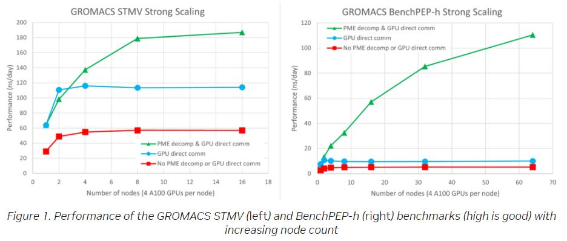

## BLOG

1. [Massively Improved Multi-node NVIDIA GPU Scalability with GROMACS](https://developer.nvidia.com/blog/massively-improved-multi-node-nvidia-gpu-scalability-with-gromacs/)
   * In this post, we showcase the latest of these improvements, made possible through the enablement of GPU Particle-mesh Ewald (PME) decomposition with GPU direct communication: a feature available in the new GROMACS 2023 release version. We observe up to 21x performance improvements enabled through this work.
   * we used four NVIDIA A100 GPUs per node on the Selene DGX-A100 cluster. For more information, see the next section in this post. Red squares, blue circles, and green triangles denote results using the legacy code path, GPU-direct communication only, and GPU-direct communication combined with GPU PME decomposition, respectively.
   * On 16 nodes, for STMV, you see a slight improvement over eight nodes, but with much less parallel efficiency. The larger benchPEP-h case scales well up to the largest 64-node (256-GPU) configuration tested, where it is 21x faster than the legacy code path, and 11x faster than the results without GPU PME decomposition.
   * Specify the total number of PME GPUs through the -npme <N> flag to mdrun. Without PME GPU decomposition, N is 1 as you can only use a single PME GPU.
   * With decomposition, you set N to the number of nodes in use, to specify one PME GPU per node, with the other three GPUs in each node dedicated to PP. This division typically gives a good balance given the relative computational expense of the PP and PME workloads, but experimentation is recommended for any specific case.
   * 

