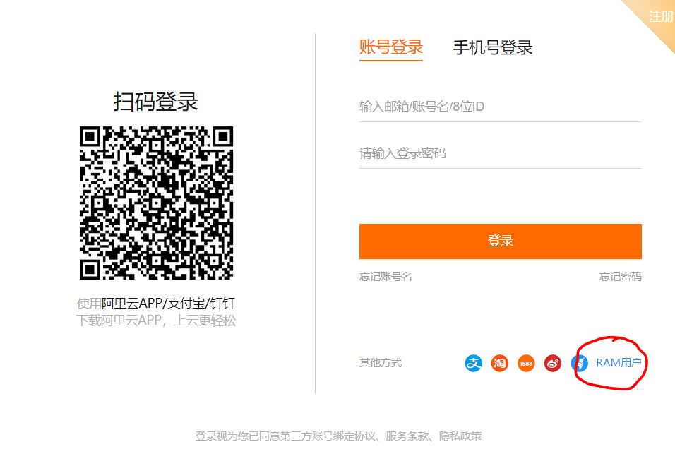
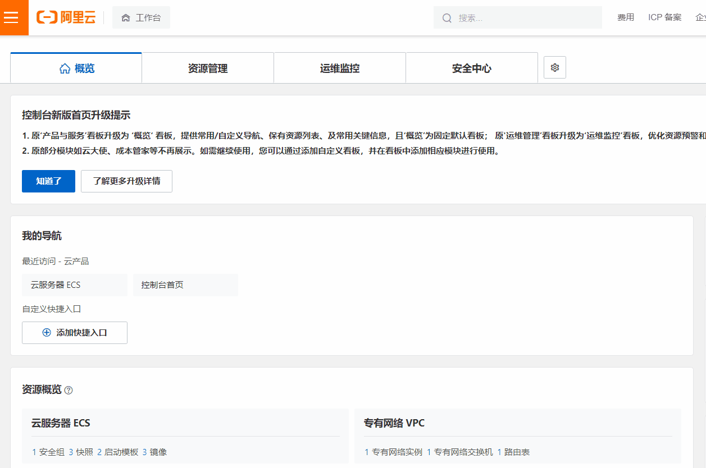
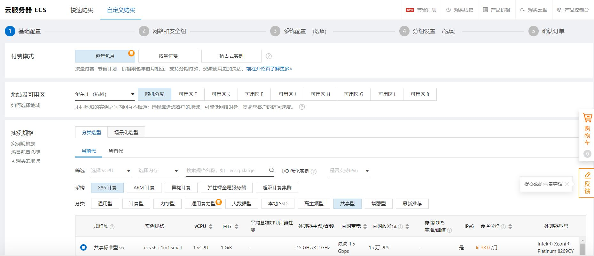
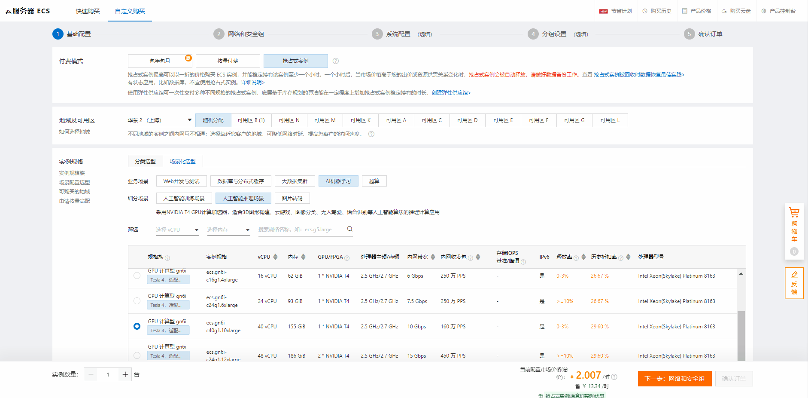
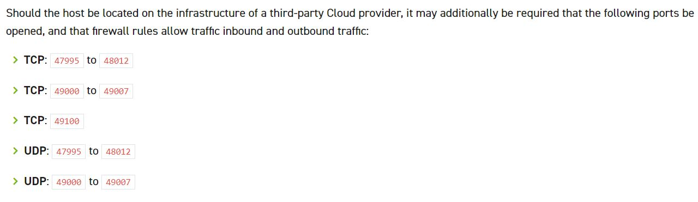
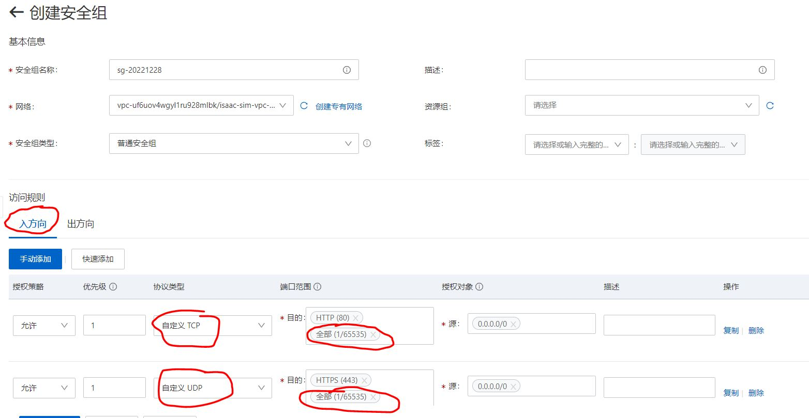
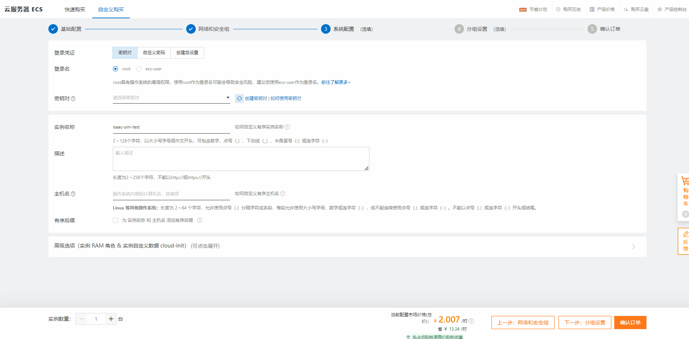
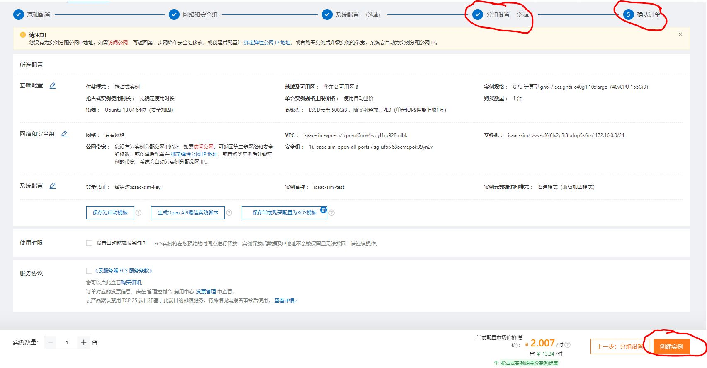
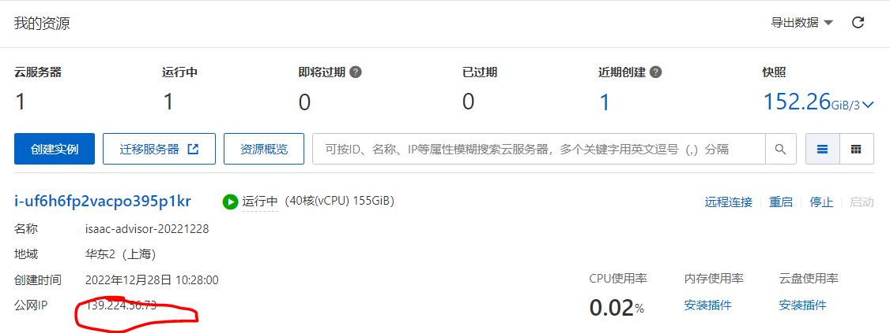

# 如何部署在阿里云上部署ISAAC SIM

  
## 1. 登录账户
    
选择`RAM用户进行登录`
    

  
## 2. 创建阿里云GPU实例

1. 如下图所示，点击左上角，选择`云服务器 ECS`，点击`实例`，点击`创建实例`，进入实例创建界面。

2. 创建实例——基础配置

    如下图所示，基础配置（根据需要进行配置）
    * 选择付费模式
    * 选择地域及可用区域
    * 选择实例，这里选择`T4`GPU
    * 抢占式实例使用时长
    * 购买实例数量：`1`
    * 选择镜像：`Ubuntu`，`18.04 64 bit`
    * 选择存储，云盘大小设置`500G`
    * 点击下一步，`下一步：网络和安全组 `

    

3. 创建实例——网络和安全组 
    如下所示，网络和安全组（根据需要进行配置）
    
    * 选择网络，用户可以选择已有网络，如本例中的`isaac-sim-vpc-sh / vpc-uf6uov4wgyl1ru928mlbk`，也可以创建新的`专有网络`，点击`前往控制台创建>`，即可进行新的`专有网络`创建。
    * 选择安全组，用户可以选择已有安全组，如本例中的` isaac-sim-open-all-ports / sg-uf6ix68ocmepok99yn2v`，也可以创建新的安全组，点击` 新建安全组>`，即可进行新的`安全组创建`。
      * 这里要特别注意，我们要保证开发所有`ISAAC SIM`所需要的端口。具体可参见[Using Omniverse Streaming Client](https://docs.omniverse.nvidia.com/app_streaming-client/app_streaming-client/user-manual.html)
      * 
      * 用户可以根据需要开放端口
      * 
    * 点击下一步：`下一步：系统配置`
4. 创建实例——系统配置
    如下所示，系统配置（根据需要进行配置）
    
    * 登录凭证，选择`密钥对`
    * 登录名，选择`root`
    * 密钥对，可以选择已有秘钥，或是创建新的秘钥，秘钥为`*.pem`格式的文件
    * 实例名称
    * 点击下一步，`下一步：分组设置`
5. 创建实例——分组配置
   * 默认设置即可
   * 点击`确认订单`
6. 确认订单
   * 点击`创建实例`
  

     
## 3. 运行实例
    实例已经创建成功，用户可以启动实例，然后通过公网ip访问实例。

  
## 4. 如何在云上运行ISAAC SIM，并通过Streaming的方式远程访问，可参照链接：[How to run ISAAC SIM on the cloud and access it remotely through Streaming](../isaac_sim_cloud_run_isaac_sim/isaac_sim_cloud_run_isaac_sim.md)

