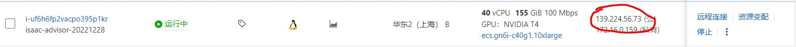
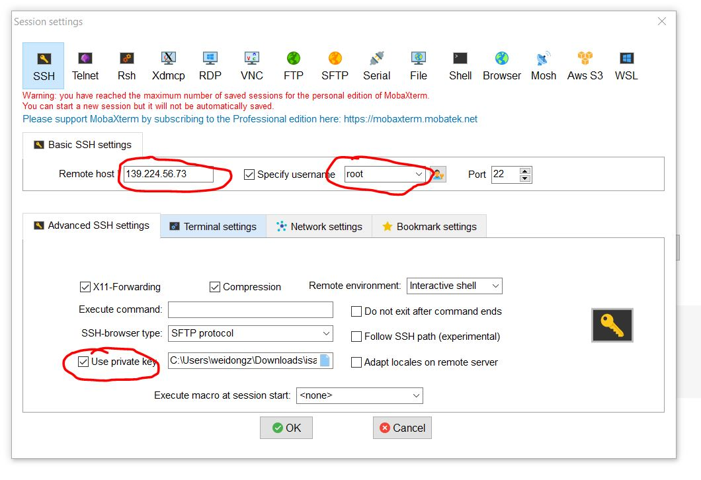
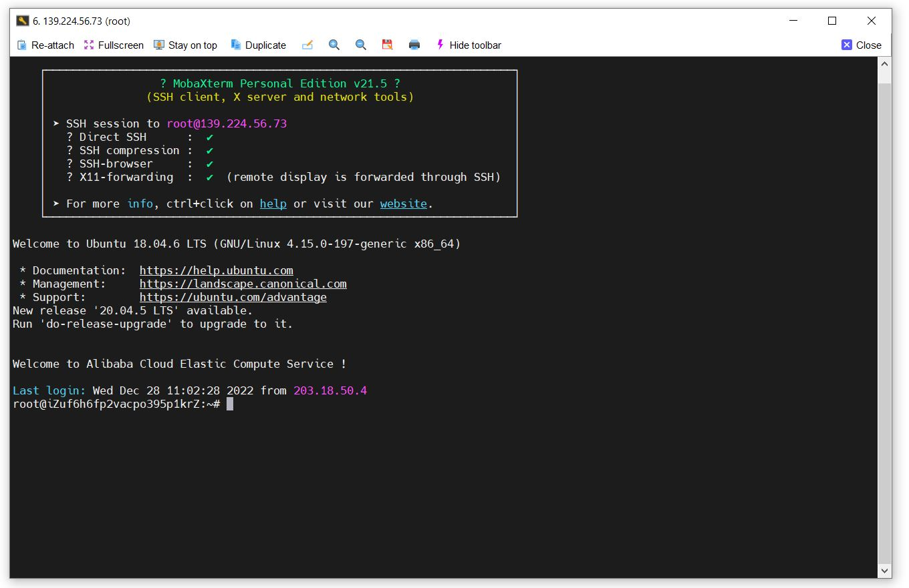
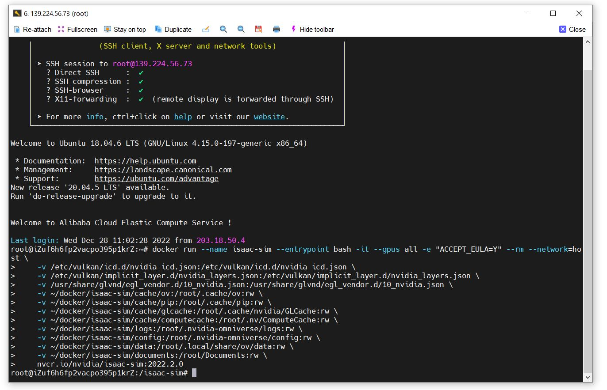
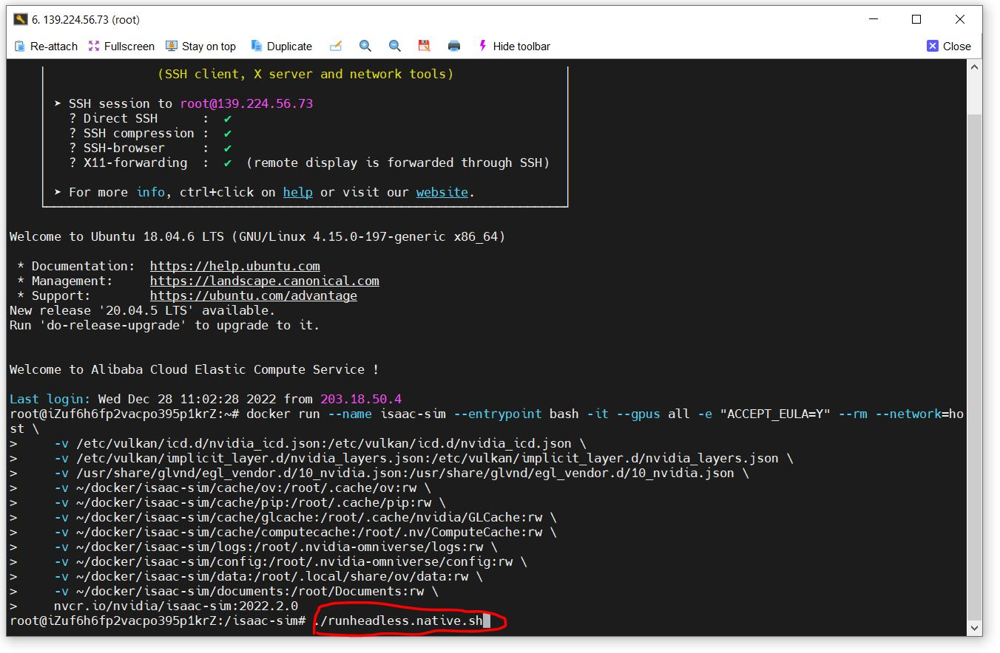
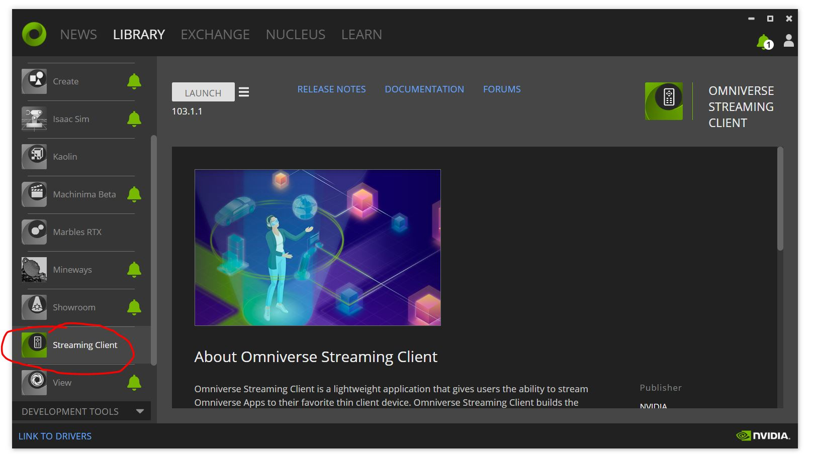
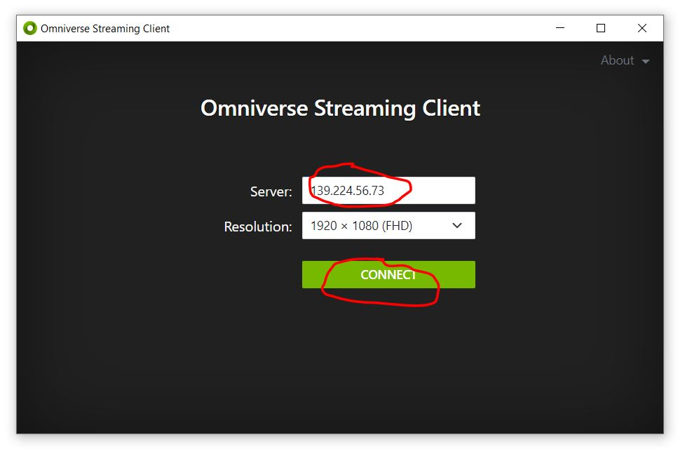

# 如何在云上运行ISAAC SIM，并通过Streaming的方式远程访问

## 1. SSH Server

这里以阿里云为例，来演示具体过程：

1. 利用ssh远程链接到实例，如图所示，我们可以链接到云服务器的ip地址`139.224.56.73`，用户调整为自己的远程ip。
   
2. 用户可以根据自己的需要，利用命令行或是终端软件进行链接，这里我使用`Mobaxterm`进行链接，`remote host`处填写上面的ip地址，`Specify username`根据实际情况填写，勾选下面的`Use private key`，并导入创建实例时生成的`*.pem`文件。点击`ok`即可链接到我们创建的云端服务器。
    
    

<br><br>

## 2.Container Installation

我们可以参考如下链接来安装`ISAAC SIM`：[ Container Installation](https://docs.omniverse.nvidia.com/app_isaacsim/app_isaacsim/install_container.html#container-installation)


### 2.1 Container Setup

参考链接：[Container Setup](https://docs.omniverse.nvidia.com/app_isaacsim/app_isaacsim/install_container.html#container-setup)

### 2.2 Container Deployment

参考链接：[Container Deployment](https://docs.omniverse.nvidia.com/app_isaacsim/app_isaacsim/install_container.html#container-deployment)

1. isaac sim的docker image部署好之后，我们可以运行`ISAAC SIM`容器:
    ```
    docker run --name isaac-sim --entrypoint bash -it --gpus all -e "ACCEPT_EULA=Y" --rm --network=host \
        -v /etc/vulkan/icd.d/nvidia_icd.json:/etc/vulkan/icd.d/nvidia_icd.json \
        -v /etc/vulkan/implicit_layer.d/nvidia_layers.json:/etc/vulkan/implicit_layer.d/nvidia_layers.json \
        -v /usr/share/glvnd/egl_vendor.d/10_nvidia.json:/usr/share/glvnd/egl_vendor.d/10_nvidia.json \
        -v ~/docker/isaac-sim/cache/ov:/root/.cache/ov:rw \
        -v ~/docker/isaac-sim/cache/pip:/root/.cache/pip:rw \
        -v ~/docker/isaac-sim/cache/glcache:/root/.cache/nvidia/GLCache:rw \
        -v ~/docker/isaac-sim/cache/computecache:/root/.nv/ComputeCache:rw \
        -v ~/docker/isaac-sim/logs:/root/.nvidia-omniverse/logs:rw \
        -v ~/docker/isaac-sim/config:/root/.nvidia-omniverse/config:rw \
        -v ~/docker/isaac-sim/data:/root/.local/share/ov/data:rw \
        -v ~/docker/isaac-sim/documents:/root/Documents:rw \
        nvcr.io/nvidia/isaac-sim:2022.2.0

    ```

    

2. 在容器内，运行`isaac sim`: `./runheadless.native.sh`
   

3. `isaac sim`启动成功，会显示`Isaac Sim Headless Native App is loaded.`，然后我们可以通过client端的` Omniverse Streaming Client`进行链接，Install and launch the [Omniverse Streaming Client](https://docs.omniverse.nvidia.com/app_streaming-client/app_streaming-client/user-manual.html) from the [Omniverse Launcher](https://docs.omniverse.nvidia.com/prod_launcher/prod_launcher/installing_launcher.html).
   * 参考链接：[Omniverse Launcher](https://docs.omniverse.nvidia.com/prod_launcher/prod_launcher/installing_launcher.html)
   * 参考链接：[Omniverse Streaming Client](https://docs.omniverse.nvidia.com/app_streaming-client/app_streaming-client/user-manual.html)

4. 通过``输入服务器的ip地址`xxx.xxx.xx.xx`，即可链接到服务器端的`isaac sim`应用
   
   
5. 我们可以使用云端的`ISAAC SIM`了
   

