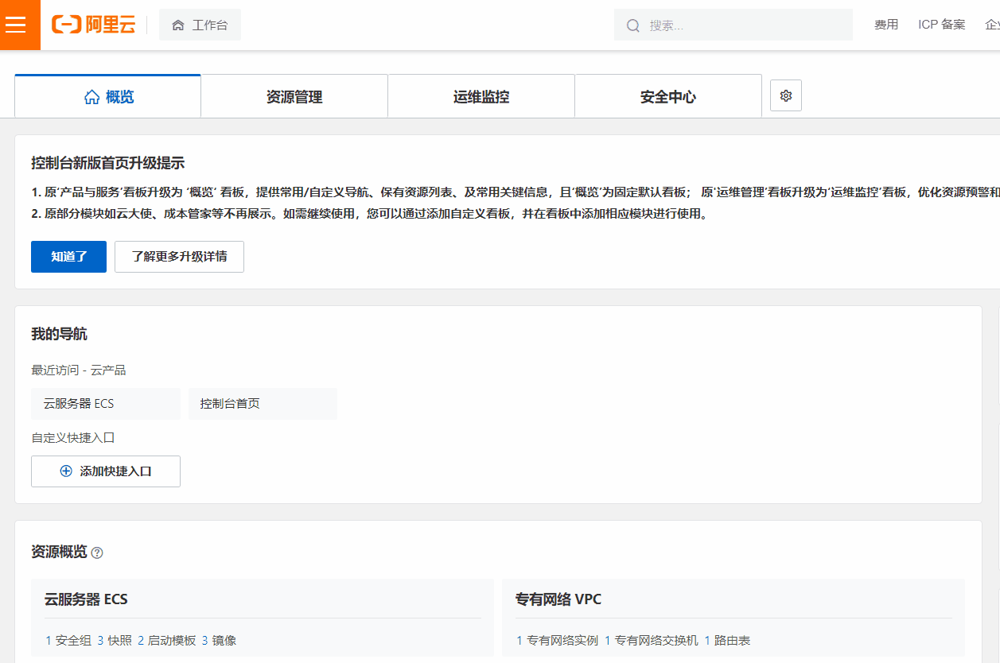
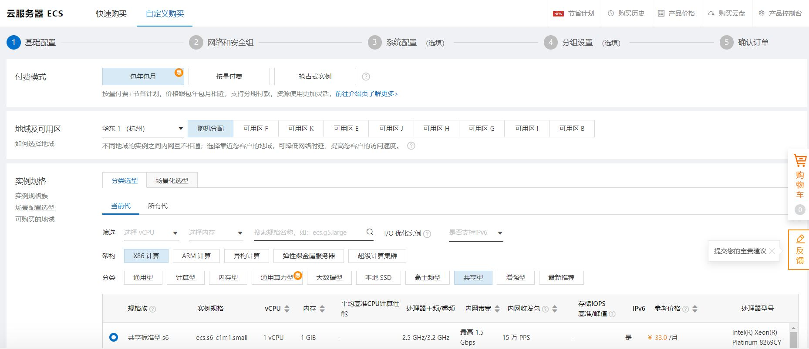
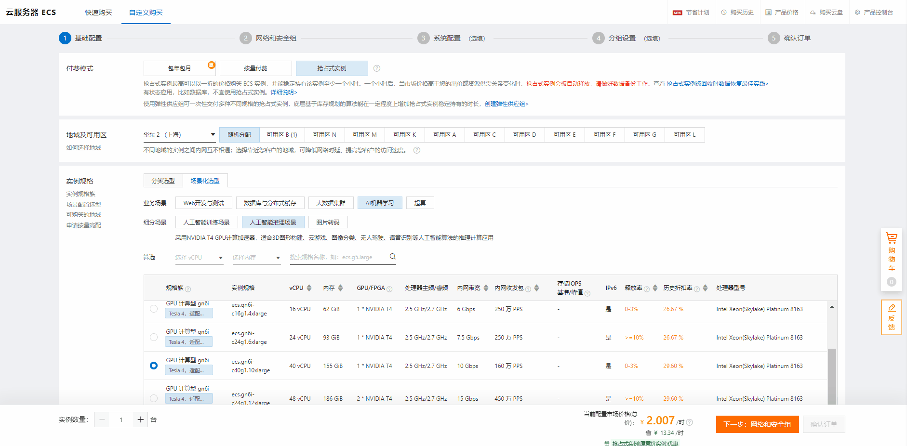
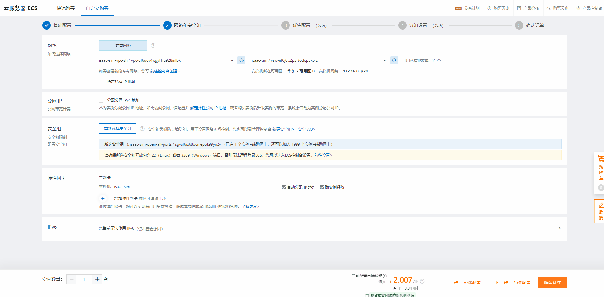
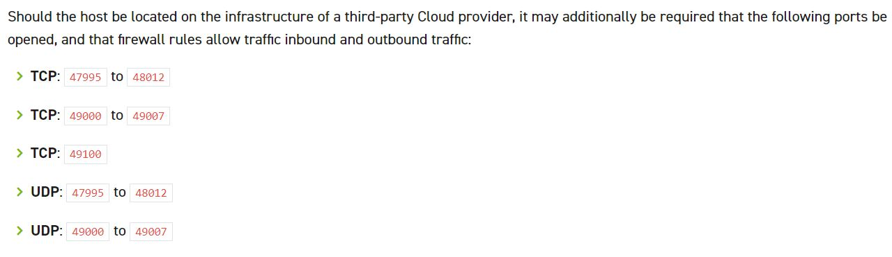
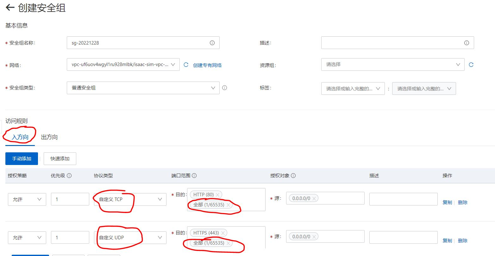
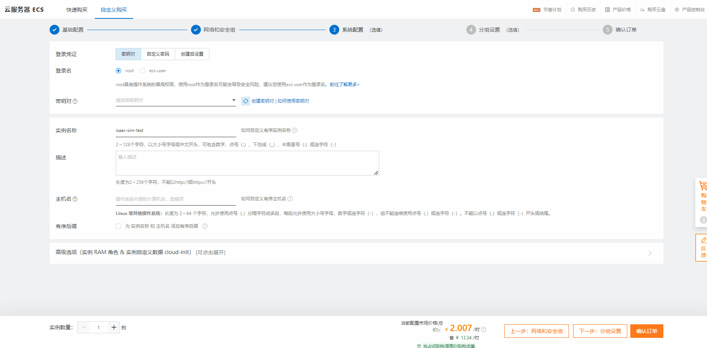
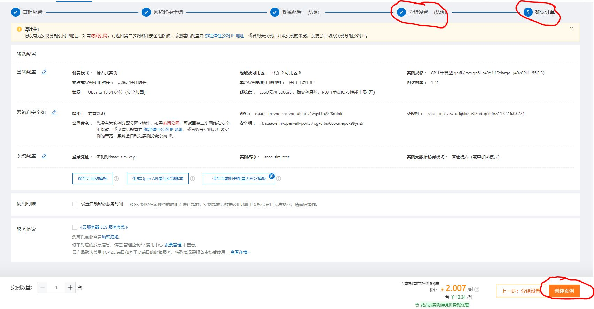
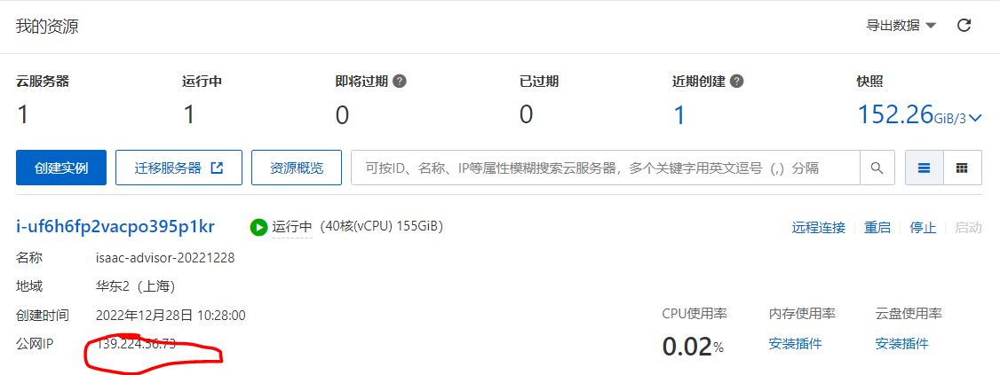

# How to deploy ISAAC SIM on Alibaba Cloud

  
## 1. login account
    
Select `RAM user to log in`
    

  
## 2. Create an Alibaba Cloud GPU instance

1. As shown in the figure below, click the upper left corner, select `Cloud Server ECS`, click `Instance`, click `Create Instance` to enter the instance creation interface.

2. Create an instance - basic configuration

     As shown in the figure below, the basic configuration (configure as needed)
     * Choose payment mode
     * Select the region and available area
     * Select the instance, here select `T4`GPU
     * The usage time of preemptible instances
     * Number of purchased instances: `1`
     * Select image: `Ubuntu`, `18.04 64 bit`
     * Select storage, and set the cloud disk size to `500G`
     * Click Next, `Next: Network and Security Groups`

    

3. Create Instance - Network and Security Group
     As shown below, network and security group (configure as needed)
     
     * Select the network, the user can select an existing network, such as `isaac-sim-vpc-sh / vpc-uf6uov4wgyl1ru928mlbk` in this example, or create a new `VPC`, click `Go to the console to create>`, A new `private network` can be created.
     * Select a security group, the user can select an existing security group, such as `isaac-sim-open-all-ports/sg-uf6ix68ocmepok99yn2v` in this example, or create a new security group, click `New Security Group>`, You can create a new `Security Group`.
       * Special attention should be paid here, we must ensure that all ports required by `ISAAC SIM` are developed. For details, see [Using Omniverse Streaming Client](https://docs.omniverse.nvidia.com/app_streaming-client/app_streaming-client/user-manual.html)
       * 
       * Users can open ports as needed
       * 
     * Click Next: `Next: System Configuration`
  
4. Create an instance - system configuration
     As shown below, the system configuration (configure as needed)
     
     * Login credentials, select `key pair`
     * Login name, select `root`
     * Key pair, you can choose an existing key, or create a new key, the key is a file in `*.pem` format
     * instance name
     * Click Next, `Next: Group Settings`
  
5. Create an instance - group configuration
    * The default setting is fine
    * Click `Confirm Order`

6. Confirm order
    * Click `Create instance`
  

     
## 3. Run the instance
     The instance has been created successfully, the user can start the instance, and then access the instance through the public network ip.

  
## 4. How to run ISAAC SIM on the cloud and access it remotely through Streaming, please refer to the link: [How to run ISAAC SIM on the cloud and access it remotely through Streaming](../isaac_sim_cloud_connect/isaac_sim_cloud_run_isaac_sim.md)

