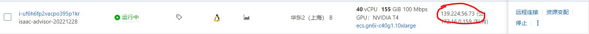
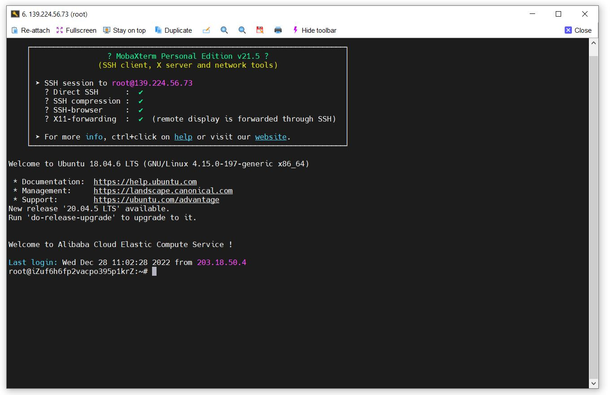
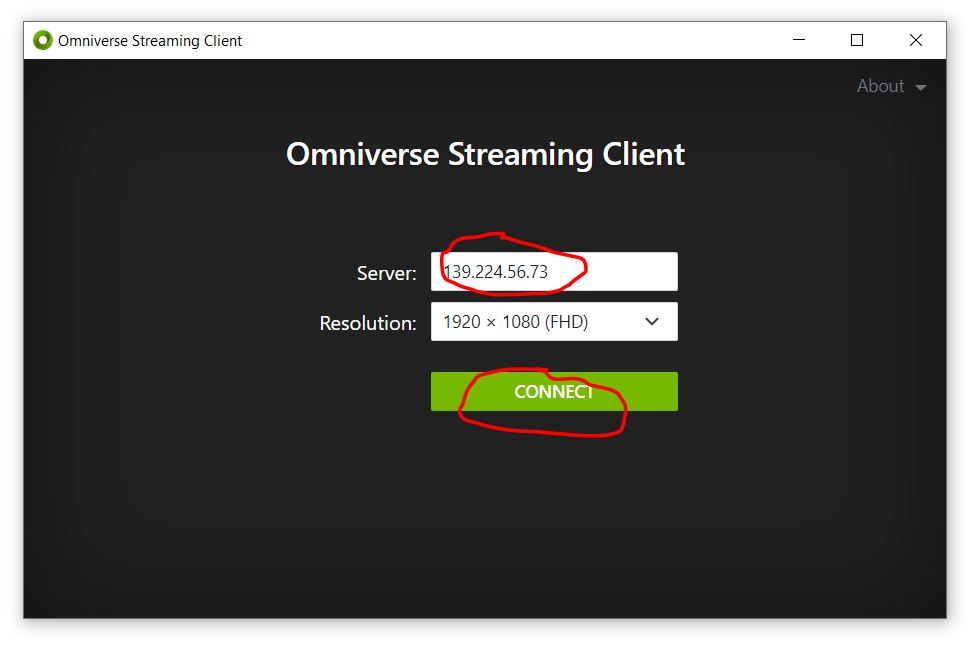

# How to run ISAAC SIM on the cloud and access it remotely through Streaming

## 1. SSH Server

Here we take Alibaba Cloud as an example to demonstrate the specific process:

1. Use ssh to remotely connect to the instance, as shown in the figure, we can connect to the cloud server's ip address `139.224.56.73`, and the user adjusts it to his own remote ip.
    
2. Users can use the command line or terminal software to link according to their own needs. Here I use `Mobaxterm` to link, fill in the above ip address in `remote host`, fill in `Specify username` according to the actual situation, check The following `Use private key`, and import the `*.pem` file generated when creating an instance. Click `ok` to link to the cloud server we created.
    
    

<br><br>

## 2.Container Installation

We can refer to the link below to install `ISAAC SIM`：[ Container Installation](https://docs.omniverse.nvidia.com/app_isaacsim/app_isaacsim/install_container.html#container-installation)


### 2.1 Container Setup

Reference link：[Container Setup](https://docs.omniverse.nvidia.com/app_isaacsim/app_isaacsim/install_container.html#container-setup)

### 2.2 Container Deployment

Reference link：[Container Deployment](https://docs.omniverse.nvidia.com/app_isaacsim/app_isaacsim/install_container.html#container-deployment)

1. After the docker image of  `ISAAC SIM`  is deployed, we can run the `ISAAC SIM` container:
    ```
    docker run --name isaac-sim --entrypoint bash -it --gpus all -e "ACCEPT_EULA=Y" --rm --network=host \
        -v /etc/vulkan/icd.d/nvidia_icd.json:/etc/vulkan/icd.d/nvidia_icd.json \
        -v /etc/vulkan/implicit_layer.d/nvidia_layers.json:/etc/vulkan/implicit_layer.d/nvidia_layers.json \
        -v /usr/share/glvnd/egl_vendor.d/10_nvidia.json:/usr/share/glvnd/egl_vendor.d/10_nvidia.json \
        -v ~/docker/isaac-sim/cache/ov:/root/.cache/ov:rw \
        -v ~/docker/isaac-sim/cache/pip:/root/.cache/pip:rw \
        -v ~/docker/isaac-sim/cache/glcache:/root/.cache/nvidia/GLCache:rw \
        -v ~/docker/isaac-sim/cache/computecache:/root/.nv/ComputeCache:rw \
        -v ~/docker/isaac-sim/logs:/root/.nvidia-omniverse/logs:rw \
        -v ~/docker/isaac-sim/config:/root/.nvidia-omniverse/config:rw \
        -v ~/docker/isaac-sim/data:/root/.local/share/ov/data:rw \
        -v ~/docker/isaac-sim/documents:/root/Documents:rw \
        nvcr.io/nvidia/isaac-sim:2022.2.0

    ```

    

2. Inside the container, run `ISAAC SIM` : `./runheadless.native.sh`
   

3.  After `ISAAC SIM` runs successfully, `Isaac Sim Headless Native App is loaded.` will be displayed, and then we can link through `Omniverse Streaming Client` on the client side, Install and launch the [Omniverse Streaming Client](https://docs .omniverse.nvidia.com/app_streaming-client/app_streaming-client/user-manual.html) from the [Omniverse Launcher](https://docs.omniverse.nvidia.com/prod_launcher/prod_launcher/installing_launcher.html).
   * Reference link：[Omniverse Launcher](https://docs.omniverse.nvidia.com/prod_launcher/prod_launcher/installing_launcher.html)
   * Reference link：[Omniverse Streaming Client](https://docs.omniverse.nvidia.com/app_streaming-client/app_streaming-client/user-manual.html)

4. Enter the ip address `xxx.xxx.xx.xx` of the server to link to the `ISAAC SIM` application on the server side
   
   
5. Now we can use `ISAAC SIM` in the cloud
   

