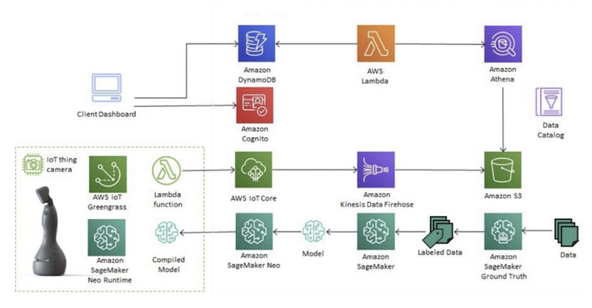
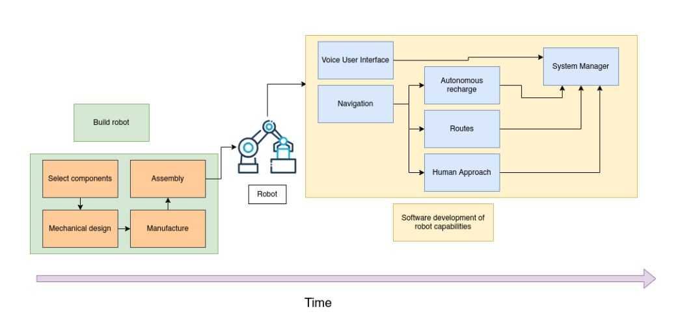
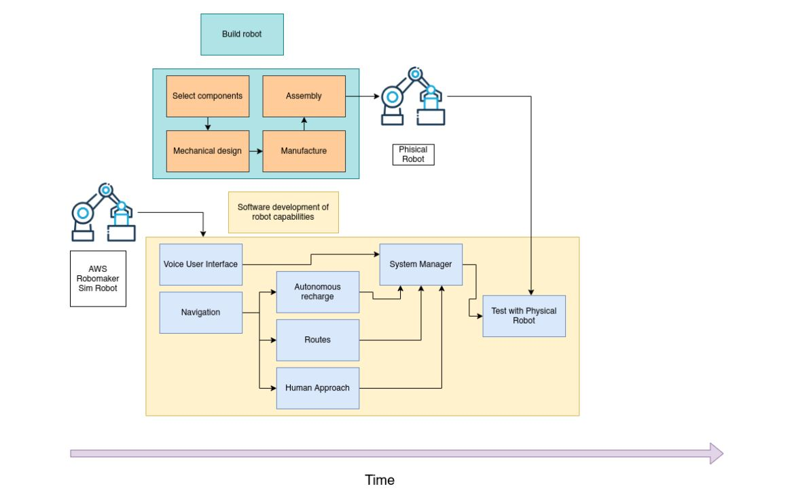
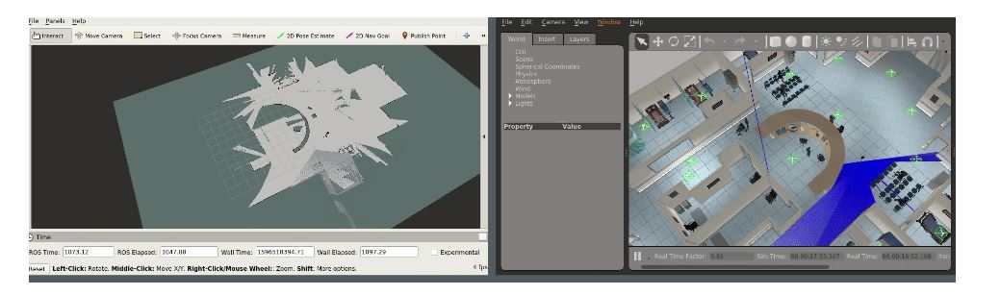

# Roomie uses AWS RoboMaker to scale custom robotics development

ref: [Roomie uses AWS RoboMaker to scale custom robotics development](https://aws.amazon.com/blogs/robotics/roomie-uses-aws-robomaker-to-scale-custom-robotics-development/)

## Introduction

> Roomie leverages AWS and open-source tools to build and deploy a wide variety of custom robot solutions for their customers across Mexico and Latin America. Roomie has created a cloud native architecture and uses AWS RoboMaker Simulation to scale and accelerate robotics development. Roomie, a fast-growing robotics startup based in Mexico City, has taken on the challenge to build interactive utility robots. Roomie builds robots to fit the needs of their customers who span a variety of industries including hospitality, manufacturing, and healthcare. With over 40 developers trained and certified in AWS services, Roomie was recognized by the MIT Technology Review as one of the most innovative startups in Latin America, and as one of the 30 most promising businesses for 2021 by Forbes Mexico.

> Roomie 利用 AWS 和开源工具为其墨西哥和拉丁美洲的客户构建和部署各种定制机器人解决方案。 Roomie 创建了一个云原生架构，并使用 AWS RoboMaker Simulation 来扩展和加速机器人开发。 Roomie 是一家位于墨西哥城的快速发展的机器人初创公司，它已经接受了构建交互式多功能机器人的挑战。 Roomie 制造机器人以满足其客户的需求，这些客户跨越多个行业，包括酒店、制造和医疗保健。 Roomie 拥有 40 多名经过 AWS 服务培训和认证的开发人员，被 MIT Technology Review 评为拉丁美洲最具创新性的初创公司之一，并被福布斯墨西哥评为 2021 年 30 家最有前途的企业之一。

 
 

## Backgroud

> Robotics companies typically build solutions by identifying an operational pain-point or customer need, then build robot prototypes to validate the feasibility of the opportunity. Most robotics startups start with building a single customer use-case and then raise capital to scale their business model. However, robotics companies face challenges scaling. Typically, prototypes heavily depend on bespoke tools and services. With an architecture of various services, it’s difficult for robotics companies to scale deployment while maintaining reliability, security, and operational excellence. Additionally, since robotics start-ups typically only have a few hardware units, it’s difficult for developers to get adequate access to the hardware for sufficient testing and integration strategies. This results in slowdowns in development speed, in late-stage production errors, and costly re-development of features.

> Roomie wanted to avoid such pitfalls by developing a scalable robot platform that would streamline adaptability of their robot to different use cases. The team at Roomie set out to execute a two-fold development strategy. First, engineers at Roomie designed system architectures incorporating cloud service capabilities to avoid developing software from scratch. This saved them development time and improved their robot functionality. Second, engineers at Roomie implemented an automatic testing workflow in simulation to test operating scenarios before deploying them to physical robots. This enables them to validate and test new code without waiting on the limitations of physical hardware.

> 机器人公司通常通过识别运营痛点或客户需求来构建解决方案，然后构建机器人原型以验证机会的可行性。大多数机器人初创公司从构建单个客户用例开始，然后筹集资金来扩展他们的商业模式。然而，机器人公司面临着扩展的挑战。通常，原型严重依赖定制工具和服务。借助各种服务的架构，机器人公司很难在保持可靠性、安全性和卓越运营的同时扩展部署。此外，由于机器人初创公司通常只有几个硬件单元，因此开发人员很难充分访问硬件以进行充分的测试和集成策略。这会导致开发速度放缓、后期生产错误以及成本高昂的功能重新开发。

> Roomie 希望通过开发一个可扩展的机器人平台来避免此类陷阱，该平台将简化其机器人对不同用例的适应性。 Roomie 的团队开始执行双重发展战略。首先，Roomie 的工程师设计了包含云服务功能的系统架构，以避免从头开始开发软件。这节省了他们的开发时间并改进了他们的机器人功能。其次，Roomie 的工程师在模拟中实施了一个自动测试工作流程，以在将操作场景部署到物理机器人之前对其进行测试。这使他们能够验证和测试新代码，而无需等待物理硬件的限制。

  

## Improving robot functionality without additional development resources

> Roomie integrated their hardware platforms with AWS services such as Amazon CloudWatch, Amazon Lex, Amazon Kinesis, Amazon S3, and Amazon Recognition via the AWS RoboMaker cloud Extensions for ROS. Integrating Roomie’s robots with Amazon Lex and Amazon Polly via the ROS cloud extension gave Roomie’s robots the ability to communicate and interact with users in a personal way. The team at Roomie used rosbag cloud extension for AWS RoboMaker to easily record and upstream their robot applications data with Amazon S3. Additionally, this approach allowed them to run queries and gain operational insight from their data with Amazon Athena in the cloud.

> For robots to interact safely in the real-word, they need advanced perception and artificial intelligence capabilities. The team at Roomie developed an obstacle detection and perception system using the Amazon Rekognition and Amazon Kinesis cloud extensions. Using CloudWatch metrics and logs engineers at Roomie were able to track incidents in their adaptive monte carlo localization stack by monitoring parameters such as PoseWithCovariance with alarms, PoseWithCovariance represents an estimation of the robot’s position in a map. Anytime a miss-localization incident would occur, engineers could trigger an alarm, and swiftly debug and troubleshoot complex behaviors that otherwise would take days to identify.

> Roomie 通过适用于 ROS 的 AWS RoboMaker 云扩展将其硬件平台与 Amazon CloudWatch、Amazon Lex、Amazon Kinesis、Amazon S3 和 Amazon Recognition 等 AWS 服务集成在一起。通过 ROS 云扩展将 Roomie 的机器人与 Amazon Lex 和 Amazon Polly 集成，让 Roomie 的机器人能够以个人方式与用户进行交流和互动。 Roomie 的团队使用 AWS RoboMaker 的 rosbag 云扩展，通过 Amazon S3 轻松记录和上传他们的机器人应用程序数据。此外，这种方法使他们能够使用云中的 Amazon Athena 运行查询并从数据中获得运营洞察力。

> 为了让机器人在现实世界中安全地进行交互，它们需要先进的感知和人工智能能力。 Roomie 的团队使用 Amazon Rekognition 和 Amazon Kinesis 云扩展开发了一个障碍物检测和感知系统。使用 CloudWatch 指标和日志，Roomie 的工程师能够通过监控带有警报的 PoseWithCovariance 等参数来跟踪其自适应蒙特卡罗定位堆栈中的事件，PoseWithCovariance 表示对机器人在地图中位置的估计。每当发生定位错误事件时，工程师都可以触发警报，并迅速调试和排除复杂行为，否则这些行为可能需要数天时间才能识别出来。

  

## Improving development and testing workflows with simulation

> Engineers at Roomie began using AWS RoboMaker to test a hospital use case for their robot. They developed this robot in response to declining hospital capacity in Mexico City during the COVID-19 pandemic. This robot was designed by Roomie Engineers to identify suspected cases of COVID-19 to help protect medical personnel and patients, avoid the spread of contagious cases, and strengthen the health system at the most critical point of the pandemic. To develop, test, and deploy this robot quickly and safely, Roomie sought out an alternative to the traditional linear robotics development workflow (Figure 2).

> The traditional robotics development workflow prevented Roomie from developing software until a physical robot was built and met design and manufacturing standards. Additionally, it would be difficult for Roomie to access real hospital environments for testing, slowing down development and iteration cycles. To avoid development delays, Roomie improved their development workflow (Figure 3) with AWS RoboMaker. Testing in RoboMaker enabled Roomie to test lidar-based navigation and map generation using simulation without waiting for the hardware team to build physical robots. Roomie engineers could work simultaneously, test different software modules, and complex behaviors, at different layers throughout early stages of robot development. Validation and verification with parallel simulations sped up development time and provided Roomie the confidence to deploy their robots in a safety critical environment like a hospital.

> Alfredo Polito, Roomie’s CTO, estimates team efficiency gains of 5.5 weeks of development time by using AWS RoboMaker Simulation. According to Alfredo, “Each engineering team was able to have a “simulated robot” all day, to develop, test, and try all ideas without being interrupted. After development and testing in simulation, they are able to converge again in areas that require development integration and testing with the physical robot.”

> Roomie 的工程师开始使用 AWS RoboMaker 为他们的机器人测试医院用例。他们开发了这款机器人，以应对 COVID-19 大流行期间墨西哥城医院容量下降的情况。该机器人由 Roomie Engineers 设计，用于识别 COVID-19 疑似病例，以帮助保护医务人员和患者，避免传染性病例传播，并在大流行最关键的时刻加强卫生系统。为了快速安全地开发、测试和部署该机器人，Roomie 寻找了传统线性机器人开发工作流程的替代方案（图 2）。

> 传统的机器人开发工作流程阻止 Roomie 开发软件，直到制造出物理机器人并满足设计和制造标准。此外，Roomie 很难访问真实的医院环境进行测试，从而减慢了开发和迭代周期。为避免开发延迟，Roomie 使用 AWS RoboMaker 改进了他们的开发工作流程（图 3）。 RoboMaker 中的测试使 Roomie 能够使用模拟测试基于激光雷达的导航和地图生成，而无需等待硬件团队构建物理机器人。 Roomie 工​​程师可以在机器人开发的早期阶段的不同层同时工作，测试不同的软件模块和复杂的行为。并行仿真的验证和验证加快了开发时间，并让 Roomie 有信心在医院等安全关键环境中部署他们的机器人。

> Roomie 的首席技术官 Alfredo Polito 估计，通过使用 AWS RoboMaker Simulation，团队效率会提高 5.5 周的开发时间。根据 Alfredo 的说法，“每个工程团队都能够拥有一个‘模拟机器人’一整天，不受干扰地开发、测试和尝试所有想法。在模拟开发和测试之后，他们能够在需要与物理机器人进行开发集成和测试的领域再次融合。”

 

 

> Engineers at Roomie used the open-source AWS RoboMaker Hospital World. This made it possible for Roomie to get started quickly running simulations in an pre-made simulation environment with the baseline characteristics of the robot’s environment.

> Roomie 的工程师使用了开源 AWS RoboMaker Hospital World。 这使得 Roomie 可以在具有机器人环境基线特征的预制模拟环境中快速开始运行模拟。

  

## Conclusion

> AWS and open-source tools enable Roomie to scale custom robot development. In this blog, we walked through how Roomie adds functionality to their robots by connecting to cloud service capabilities, without additional development resources. We also walked through how AWS RoboMaker Simulation helped Roomie speed up their development workflow and without the limitations of physical testing.

> AWS 和开源工具使 Roomie 能够扩展自定义机器人开发。 在本博客中，我们介绍了 Roomie 如何通过连接到云服务功能为他们的机器人添加功能，而无需额外的开发资源。 我们还介绍了 AWS RoboMaker Simulation 如何帮助 Roomie 加快他们的开发工作流程，并且不受物理测试的限制。

