# 如何部署在腾讯云上部署ISAAC SIM

  
## 1. 登录账户

* 登录腾讯云的主页：[https://www.tencentcloud.com/](https://www.tencentcloud.com/)
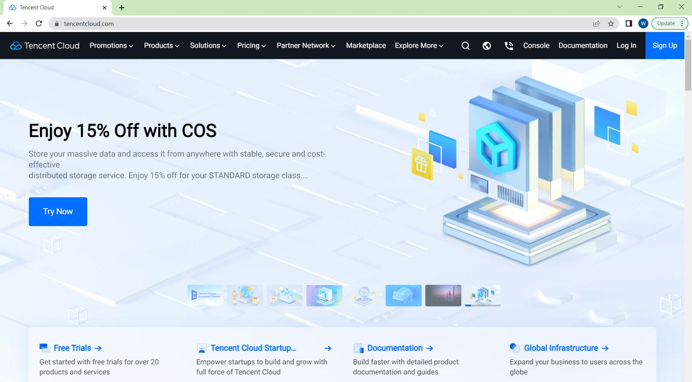

* 点击`Log in`
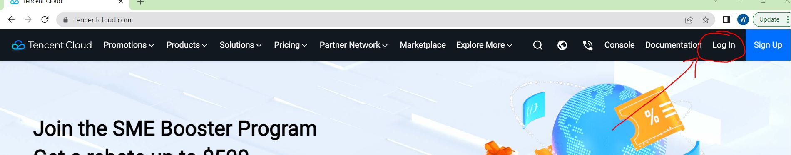

* 选择企业用户登录，点击`CAM user sign in`
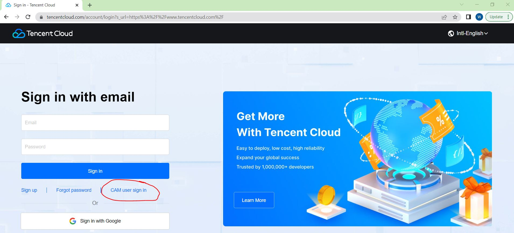

* 进入如下页面，输入`id`,`sub-user name`,`Password`，然后点击`sign in`
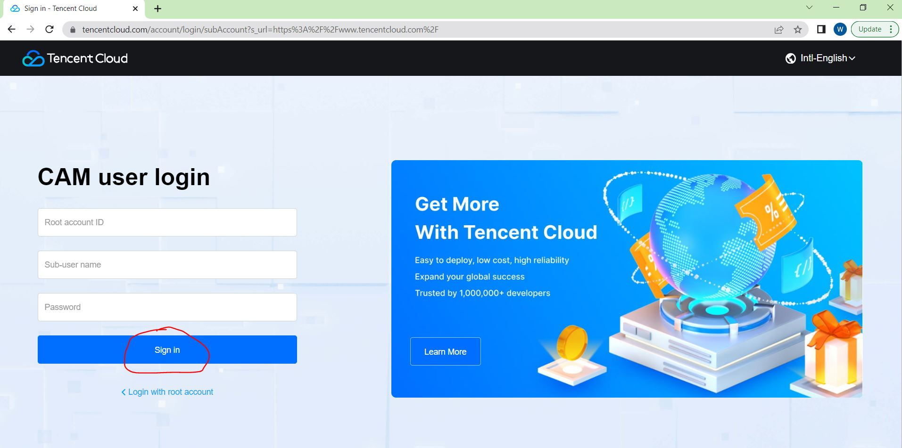

* 进入如下界面
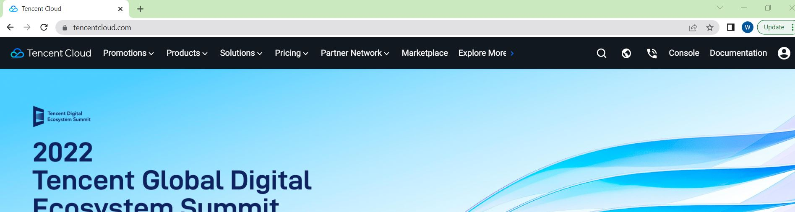

  
## 2. 创建腾讯云实例

* 在`Products`下拉选项卡中，点击`04 Cloud Virtual Machine`

* 点击`Get Started`

* 进入`Cloud Virtual Machine`页面，在最左侧一栏选择`Instances`，可以通过`create`按钮创建新的实例，也可以`Start Up`按钮启动已有的实例。这里，我们点击`create`按钮去创建一个新的实例。

****
### Cloud Virtual Machine (CVM)

* 进入如下`CVM`界面，我们开始按照步骤创建一台云服务实例。
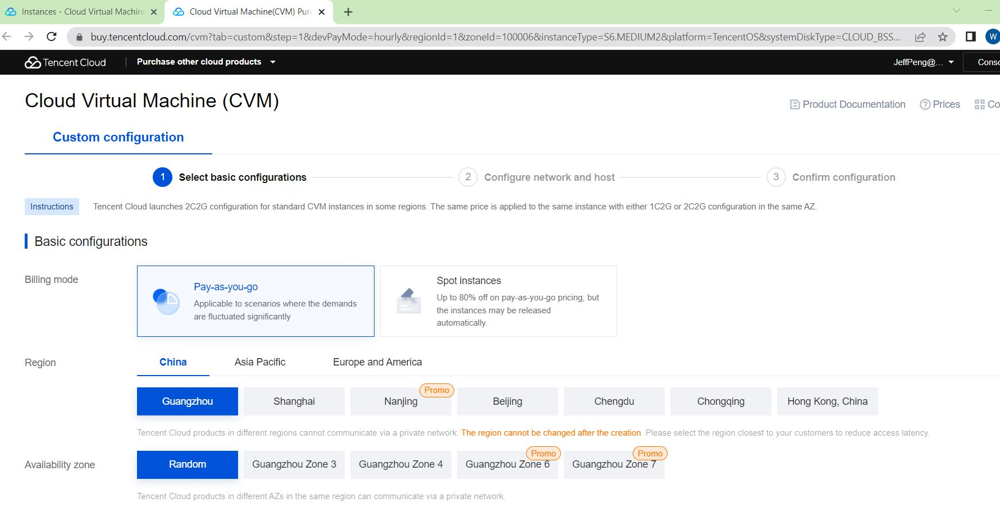

#### Slect basic configurations

* Basic configurations: 这里我们选择`T4`显卡的`Spot instances`，服务器区域选择`China`,`Guangzhou`，Availability Zone选择`Random`，这里用户也可以根据自己的需要进行选择。
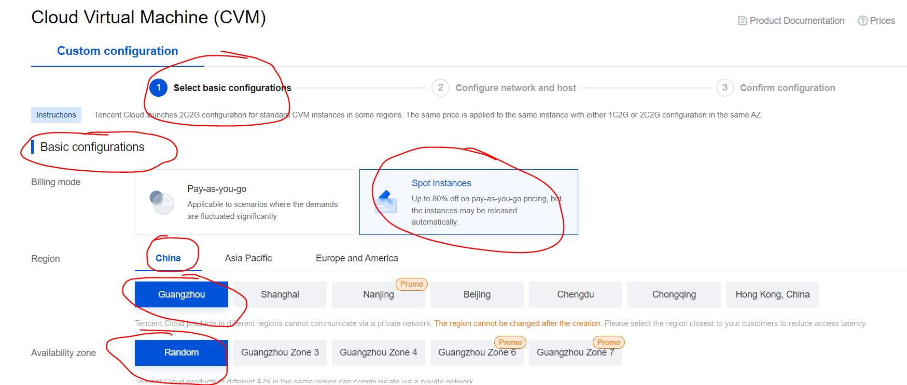

* Instance configurations: 这里我们选择`GPU-based`, `GPU Compute GN7`(即为`T4`显卡)

* Instance configurations: 实例的操作系统，选择`Ubuntu`，`18.04`版本，不要勾选`Install GPU driver automatically`，Storage选择`500GB`或更大的容量。
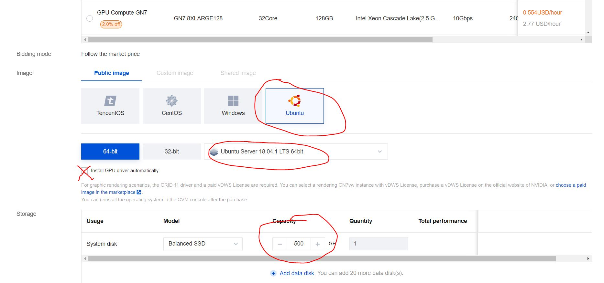

* `Slect basic configurations`配置选择完成后，点击`Next: Configure network and host`，点击确认`Confirm`

#### Configure network and host

* 创建网络，分别点击`create a VPC`和`a subnet`进行私有网络和子网的创建，按照提示操作即可。网络带宽`Bandwidth`这里选择`20Mbps`。注意：创建`subnet`时，`Availability zone`的区域选择要和`Slect basic configurations`中`Instance configurations`的`Availability zone`相同。

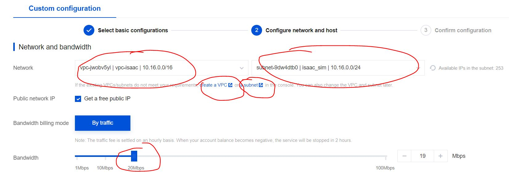

* 选择`Security Group`，这一步至关重要；要保证isaac sim远程连接所需要的端口全部开放，这里为了简单，我们选择`Open all ports`，实际操作中，为了保证安全，用户要根据自己的需求，选择对外开放的端口。这里要特别注意，我们要保证开发所有`ISAAC SIM`所需要的端口。具体可参见[Using Omniverse Streaming Client](https://docs.omniverse.nvidia.com/app_streaming-client/app_streaming-client/user-manual.html)

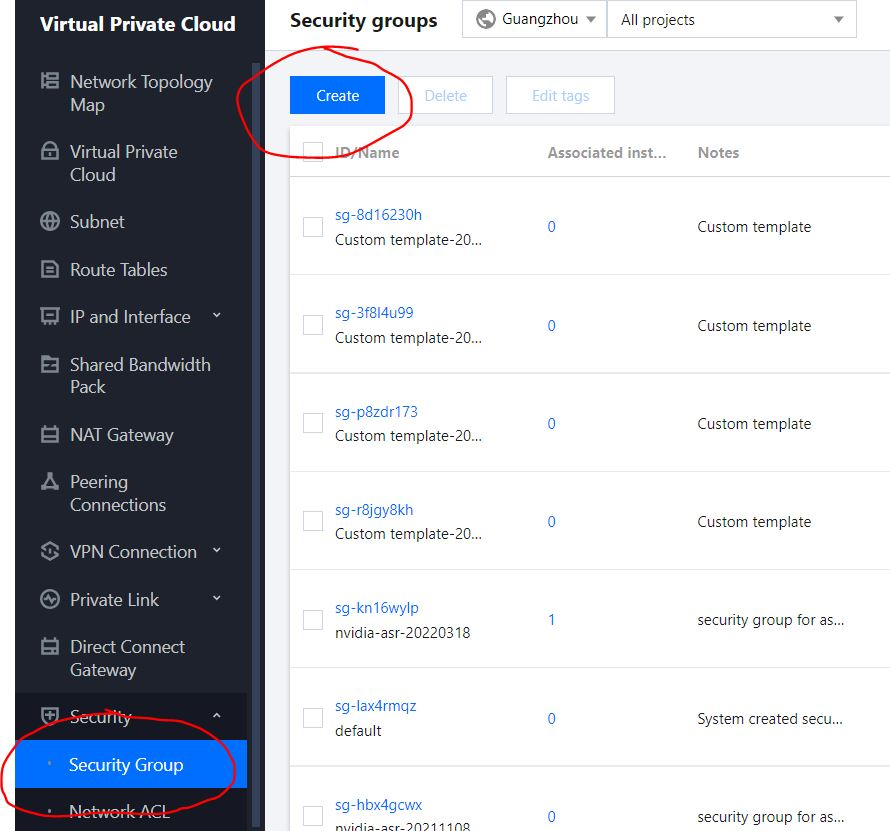
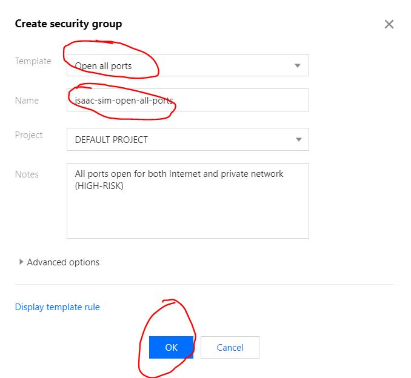
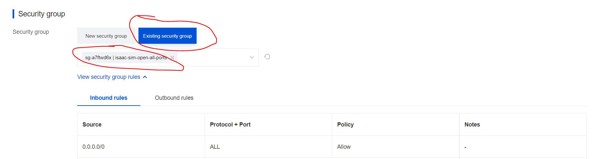

* Other Settings：创建key，以便`ssh`连接使用
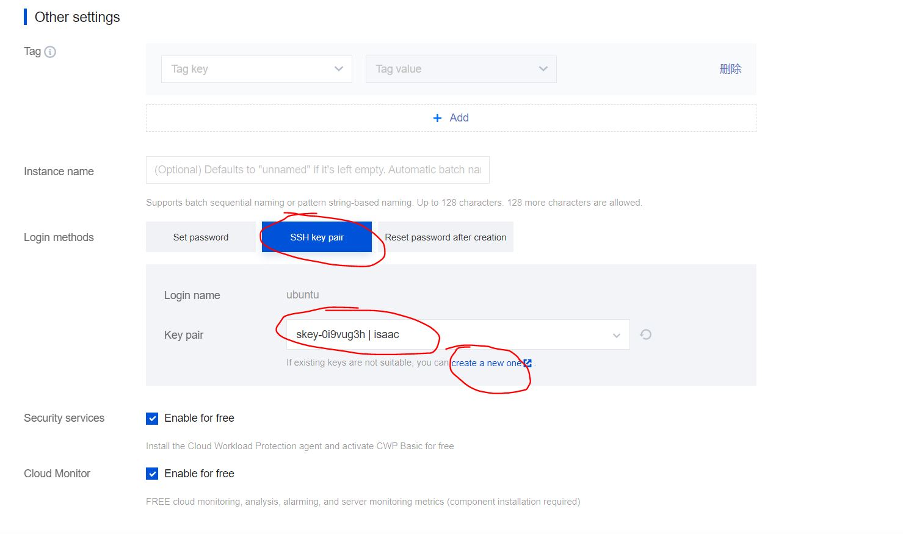

* `Config network and host`完成之后，点击`Next: Confirm configuration`

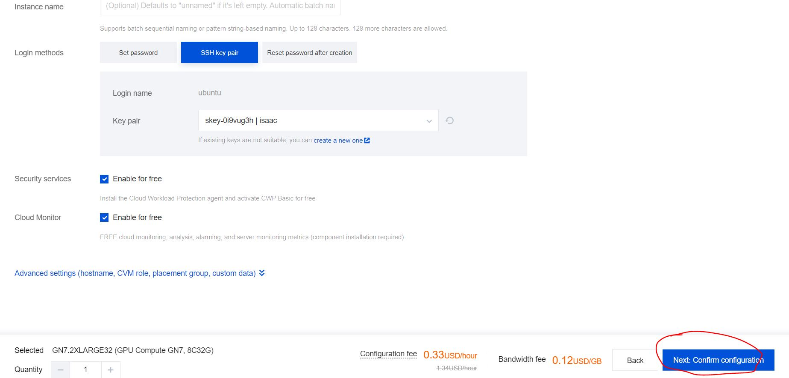

## 2. 运行实例