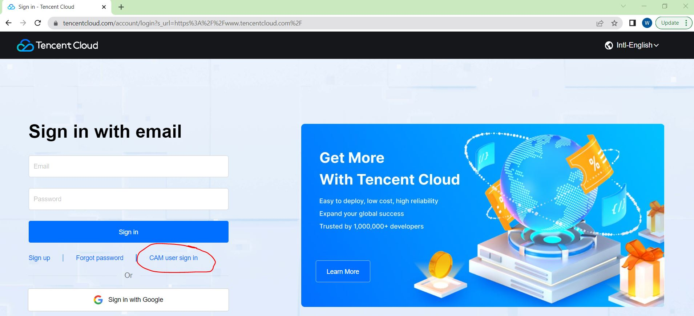
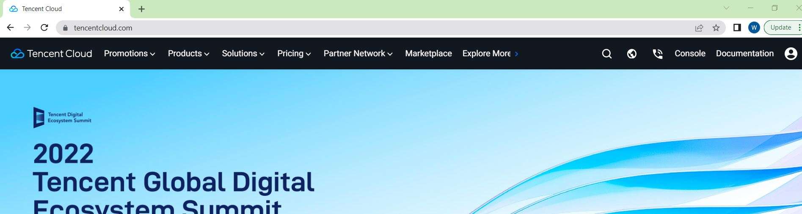
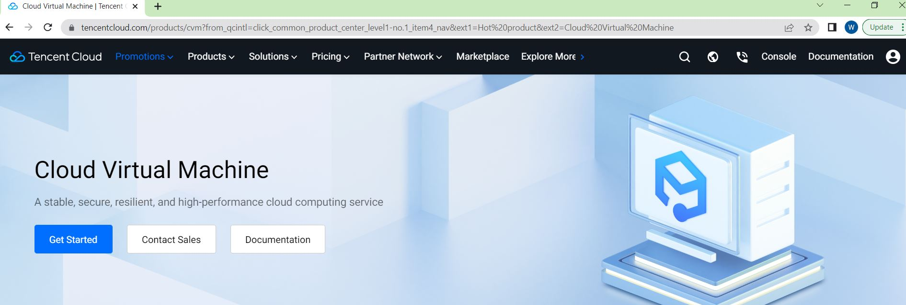
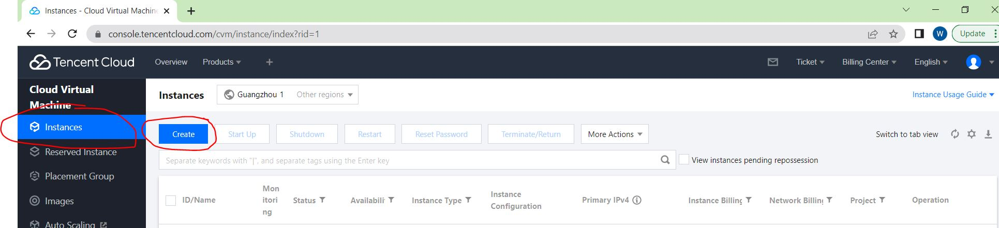
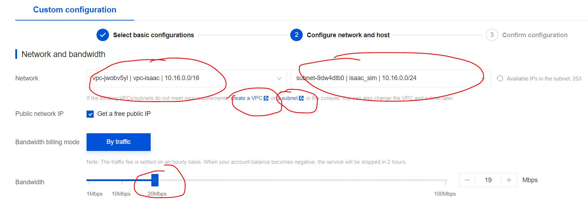
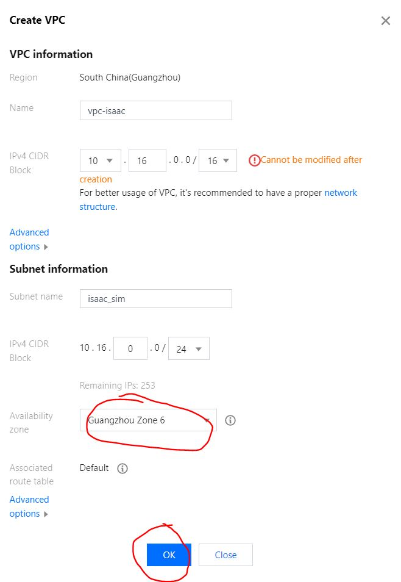
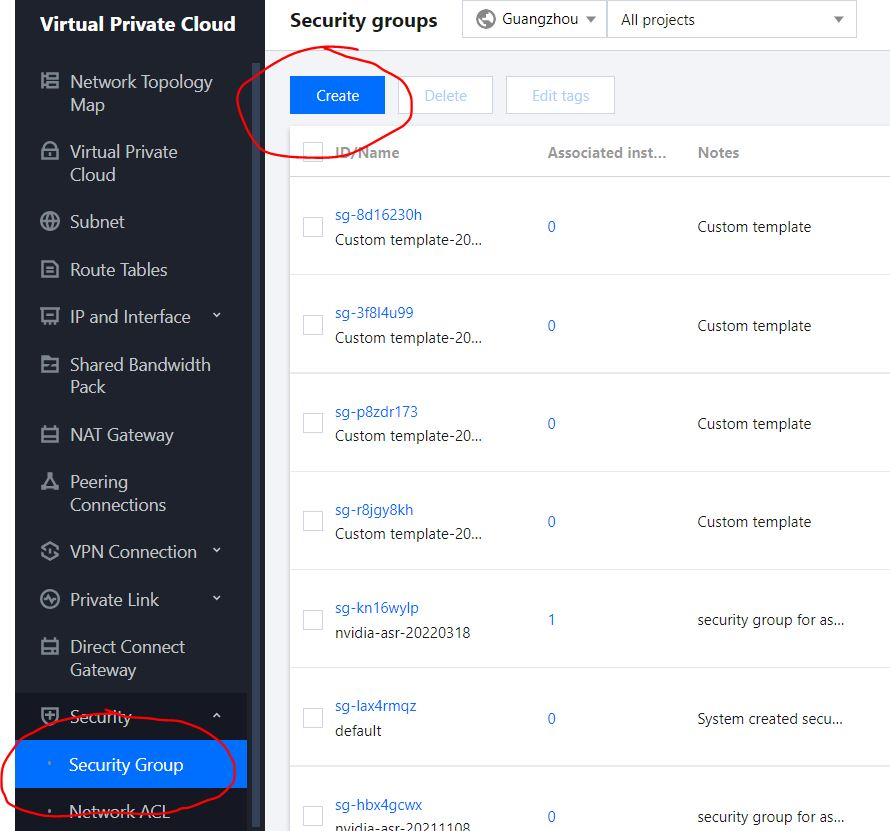
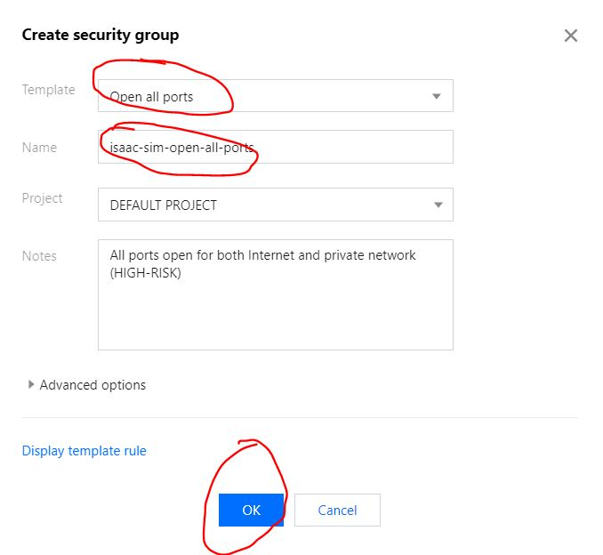
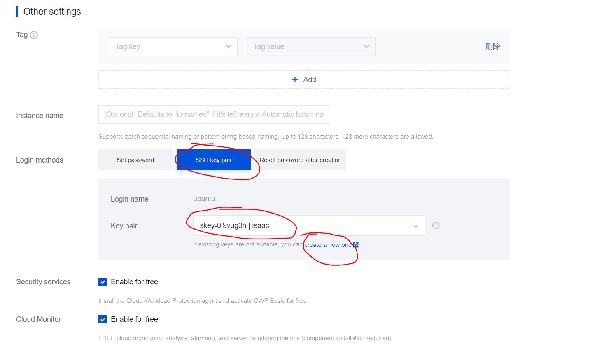

# How to deploy ISAAC SIM on Tencent Cloud

  
## 1. login account

1. Log in to the homepage of Tencent Cloud：[https://www.tencentcloud.com/](https://www.tencentcloud.com/)

2. Click `Log in`

3. Select enterprise user login, click `CAM user sign in`

4. Enter the following page, enter `id`, `sub-user name`, `Password`, and click `sign in`

5. Enter the following page

  
## 2. Create a Tencent Cloud instance

1. In the `Products` drop-down tab, click `04 Cloud Virtual Machine`

2. Click `Get Started`

3. Enter the `Cloud Virtual Machine` page, select `Instances` in the leftmost column, you can create a new instance through the `create` button, or start an existing instance by using the `Start Up` button. Here, we click the `create` button to create a new instance.

  
## 3. Cloud Virtual Machine (CVM)

* Enter the `CVM` interface as follows, and we start to create a cloud service instance according to the steps.

### 3.1 Slect basic configurations

* Basic configurations: Here we choose `Spot instances` of `T4` graphics card, `China`, `Guangzhou` are selected for the server area, `Random` is selected for the Availability Zone, here users can also choose according to their own needs.

* Instance configurations: Here we choose `GPU-based`, `GPU Compute GN7` (that is, `T4` graphics card)

* Instance configurations: The operating system of the instance, select `Ubuntu`, `18.04` version, do not check `Install GPU driver automatically`, select `500GB` or larger capacity for Storage.

* After the `Select basic configurations` configuration selection is completed, click `Next: Configure network and host`, and click `Confirm`

### 3.2 Configure network and host

* To create a network, click `create a VPC` and `a subnet` respectively to create a private network and a subnet, and follow the prompts. For network bandwidth `Bandwidth` here, select `20Mbps`. Note: When creating `subnet`, the region selection of `Availability zone` should be the same as `Availability zone` of `Instance configurations` in `Select basic configurations`.

* Select `Security Group`, this step is very important; to ensure that all the ports required for isaac sim remote connection are open, here for simplicity, we choose `Open all ports`, in actual operation, in order to ensure security, the user should If required, select a port that is open to the outside world.  Special attention should be paid here, we must ensure that all the ports required by `ISAAC SIM` are developed. For details, see [Using Omniverse Streaming Client](https://docs.omniverse.nvidia.com/app_streaming-client/app_streaming-client/user-manual.html)

* Other Settings: Create a key for `ssh` connections. You can select an existing secret key or create a new secret key. The secret key is a file in `*.pem` format.

* After `Config network and host` is complete, click `Next: Confirm configuration`

## 4. run instance

The instance has been created successfully, the user can start the instance, and then access the instance through the public network ip.