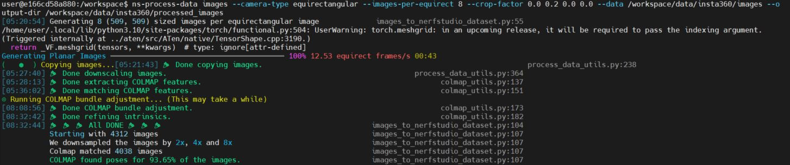
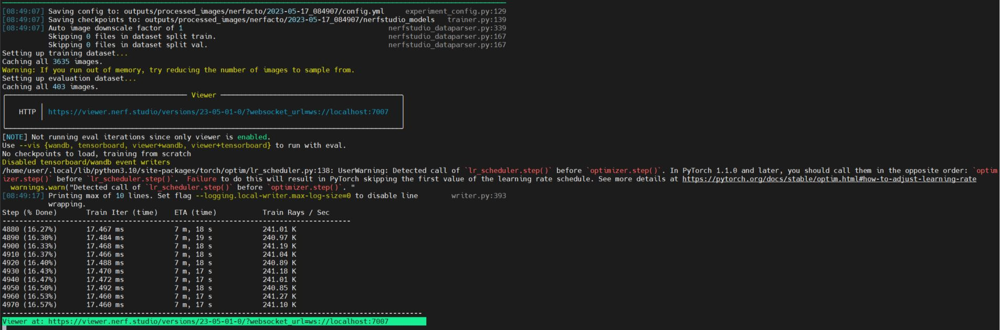

# Insta360数据重建

## Insta360数据处理

insta 360 数据处理，生成相机位姿, ref:[360 Data (Equirectangular)](https://docs.nerf.studio/en/latest/quickstart/custom_dataset.html#data-equirectangular)：

```
ns-process-data images --camera-type equirectangular --images-per-equirect 8 --crop-factor 0.0 0.2 0.utput-dir /workspace/data/insta360/processed_images
```

运行结果如下：

```
utput-dir /workspace/data/insta360/processed_images
[05:20:54] Generating 8 (509, 509) sized images per equirectangular image             images_to_nerfstudio_dataset.py:55
/home/user/.local/lib/python3.10/site-packages/torch/functional.py:504: UserWarning: torch.meshgrid: in an upcoming release, it wil
(Triggered internally at ../aten/src/ATen/native/TensorShape.cpp:3190.)
  return _VF.meshgrid(tensors, **kwargs)  # type: ignore[attr-defined]
Generating Planar Images ━━━━━━━━━━━━━━━━━━━━━━━━━━━━━━━━━━━━━━━━ 100% 12.53 equirect frames/s 00:43
(   ●  ) Copying images...[05:21:43] 🎉 Done copying images.                                                             process_da
[05:27:40] 🎉 Done downscaling images.                                                         process_data_utils.py:364
[05:28:13] 🎉 Done extracting COLMAP features.                                                       colmap_utils.py:137
[05:36:02] 🎉 Done matching COLMAP features.                                                         colmap_utils.py:151
⊙ Running COLMAP bundle adjustment... (This may take a while)
[08:08:56] 🎉 Done COLMAP bundle adjustment.                                                         colmap_utils.py:173
[08:32:42] 🎉 Done refining intrinsics.                                                              colmap_utils.py:182
[08:32:44] 🎉 🎉 🎉 All DONE 🎉 🎉 🎉                                                images_to_nerfstudio_dataset.py:104
           Starting with 4312 images                                                 images_to_nerfstudio_dataset.py:107
           We downsampled the images by 2x, 4x and 8x                                images_to_nerfstudio_dataset.py:107
           Colmap matched 4038 images                                                images_to_nerfstudio_dataset.py:107
           COLMAP found poses for 93.65% of the images.                              images_to_nerfstudio_dataset.py:107

```




**程序运行完，数据输出到`/workspace/data/insta360/processed_images`路径下，之后的3D重建基于此数据。**

<br>

## 训练

ref: [Train and run viewer](https://docs.nerf.studio/en/latest/quickstart/first_nerf.html#train-and-run-viewer)

```
ns-train nerfacto --data /workspace/data/insta360/processed_images --viewer.websocket-port 7007
```

运行程序如下：

```
user@e166cd58a880:/workspace$ ns-train nerfacto --data /workspace/data/insta360/processed_images --viewer.websocket-port 7007
[08:49:07] Using --data alias for --data.pipeline.datamanager.data                                          train.py:222
──────────────────────────────────────────────────────── Config ────────────────────────────────────────────────────────
TrainerConfig(
    _target=<class 'nerfstudio.engine.trainer.Trainer'>,
    output_dir=PosixPath('outputs'),
    method_name='nerfacto',
    experiment_name=None,
    timestamp='2023-05-17_084907',
    machine=MachineConfig(seed=42, num_gpus=1, num_machines=1, machine_rank=0, dist_url='auto'),
    logging=LoggingConfig(
        relative_log_dir=PosixPath('.'),
        steps_per_log=10,
        max_buffer_size=20,
        local_writer=LocalWriterConfig(
            _target=<class 'nerfstudio.utils.writer.LocalWriter'>,
            enable=True,
            stats_to_track=(
                <EventName.ITER_TRAIN_TIME: 'Train Iter (time)'>,
                <EventName.TRAIN_RAYS_PER_SEC: 'Train Rays / Sec'>,
                <EventName.CURR_TEST_PSNR: 'Test PSNR'>,
                <EventName.VIS_RAYS_PER_SEC: 'Vis Rays / Sec'>,
                <EventName.TEST_RAYS_PER_SEC: 'Test Rays / Sec'>,
                <EventName.ETA: 'ETA (time)'>
            ),
            max_log_size=10
        ),
        profiler='basic'
    ),
    viewer=ViewerConfig(
        relative_log_filename='viewer_log_filename.txt',
        websocket_port=7007,
        websocket_port_default=7007,
        websocket_host='0.0.0.0',
        num_rays_per_chunk=32768,
        max_num_display_images=512,
        quit_on_train_completion=False,
        image_format='jpeg',
        jpeg_quality=90
    ),
    pipeline=VanillaPipelineConfig(
        _target=<class 'nerfstudio.pipelines.base_pipeline.VanillaPipeline'>,
        datamanager=VanillaDataManagerConfig(
            _target=<class 'nerfstudio.data.datamanagers.base_datamanager.VanillaDataManager'>,
            data=PosixPath('/workspace/data/insta360/processed_images'),
            camera_optimizer=CameraOptimizerConfig(
                _target=<class 'nerfstudio.cameras.camera_optimizers.CameraOptimizer'>,
                mode='SO3xR3',
                position_noise_std=0.0,
                orientation_noise_std=0.0,
                optimizer=AdamOptimizerConfig(
                    _target=<class 'torch.optim.adam.Adam'>,
                    lr=0.0006,
                    eps=1e-08,
                    max_norm=None,
                    weight_decay=0.01
                ),
                scheduler=ExponentialDecaySchedulerConfig(
                    _target=<class 'nerfstudio.engine.schedulers.ExponentialDecayScheduler'>,
                    lr_pre_warmup=1e-08,
                    lr_final=6e-06,
                    warmup_steps=0,
                    max_steps=200000,
                    ramp='cosine'
                ),
                param_group='camera_opt'
            ),
            dataparser=NerfstudioDataParserConfig(
                _target=<class 'nerfstudio.data.dataparsers.nerfstudio_dataparser.Nerfstudio'>,
                data=PosixPath('.'),
                scale_factor=1.0,
                downscale_factor=None,
                scene_scale=1.0,
                orientation_method='up',
                center_method='poses',
                auto_scale_poses=True,
                train_split_fraction=0.9,
                depth_unit_scale_factor=0.001
            ),
            train_num_rays_per_batch=4096,
            train_num_images_to_sample_from=-1,
            train_num_times_to_repeat_images=-1,
            eval_num_rays_per_batch=4096,
            eval_num_images_to_sample_from=-1,
            eval_num_times_to_repeat_images=-1,
            eval_image_indices=(0,),
            camera_res_scale_factor=1.0,
            patch_size=1
        ),
        model=NerfactoModelConfig(
            _target=<class 'nerfstudio.models.nerfacto.NerfactoModel'>,
            enable_collider=True,
            collider_params={'near_plane': 2.0, 'far_plane': 6.0},
            loss_coefficients={'rgb_loss_coarse': 1.0, 'rgb_loss_fine': 1.0},
            eval_num_rays_per_chunk=32768,
            near_plane=0.05,
            far_plane=1000.0,
            background_color='last_sample',
            hidden_dim=64,
            hidden_dim_color=64,
            hidden_dim_transient=64,
            num_levels=16,
            max_res=2048,
            log2_hashmap_size=19,
            num_proposal_samples_per_ray=(256, 96),
            num_nerf_samples_per_ray=48,
            proposal_update_every=5,
            proposal_warmup=5000,
            num_proposal_iterations=2,
            use_same_proposal_network=False,
            proposal_net_args_list=[
                {'hidden_dim': 16, 'log2_hashmap_size': 17, 'num_levels': 5, 'max_res': 128, 'use_linear': False},
                {'hidden_dim': 16, 'log2_hashmap_size': 17, 'num_levels': 5, 'max_res': 256, 'use_linear': False}
            ],
            proposal_initial_sampler='piecewise',
            interlevel_loss_mult=1.0,
            distortion_loss_mult=0.002,
            orientation_loss_mult=0.0001,
            pred_normal_loss_mult=0.001,
            use_proposal_weight_anneal=True,
            use_average_appearance_embedding=True,
            proposal_weights_anneal_slope=10.0,
            proposal_weights_anneal_max_num_iters=1000,
            use_single_jitter=True,
            predict_normals=False,
            disable_scene_contraction=False
        )
    ),
    optimizers={
        'proposal_networks': {
            'optimizer': AdamOptimizerConfig(
                _target=<class 'torch.optim.adam.Adam'>,
                lr=0.01,
                eps=1e-15,
                max_norm=None,
                weight_decay=0
            ),
            'scheduler': ExponentialDecaySchedulerConfig(
                _target=<class 'nerfstudio.engine.schedulers.ExponentialDecayScheduler'>,
                lr_pre_warmup=1e-08,
                lr_final=0.0001,
                warmup_steps=0,
                max_steps=200000,
                ramp='cosine'
            )
        },
        'fields': {
            'optimizer': AdamOptimizerConfig(
                _target=<class 'torch.optim.adam.Adam'>,
                lr=0.01,
                eps=1e-15,
                max_norm=None,
                weight_decay=0
            ),
            'scheduler': ExponentialDecaySchedulerConfig(
                _target=<class 'nerfstudio.engine.schedulers.ExponentialDecayScheduler'>,
                lr_pre_warmup=1e-08,
                lr_final=0.0001,
                warmup_steps=0,
                max_steps=200000,
                ramp='cosine'
            )
        }
    },
    vis='viewer',
    data=PosixPath('/workspace/data/insta360/processed_images'),
    relative_model_dir=PosixPath('nerfstudio_models'),
    steps_per_save=2000,
    steps_per_eval_batch=500,
    steps_per_eval_image=500,
    steps_per_eval_all_images=25000,
    max_num_iterations=30000,
    mixed_precision=True,
    use_grad_scaler=False,
    save_only_latest_checkpoint=True,
    load_dir=None,
    load_step=None,
    load_config=None,
    log_gradients=False
)
────────────────────────────────────────────────────────────────────────────────────────────────────────────────────────
[08:49:07] Saving config to: outputs/processed_images/nerfacto/2023-05-17_084907/config.yml     experiment_config.py:129
[08:49:07] Saving checkpoints to: outputs/processed_images/nerfacto/2023-05-17_084907/nerfstudio_models   trainer.py:139
[08:49:07] Auto image downscale factor of 1                                                 nerfstudio_dataparser.py:339
           Skipping 0 files in dataset split train.                                         nerfstudio_dataparser.py:167
           Skipping 0 files in dataset split val.                                           nerfstudio_dataparser.py:167
Setting up training dataset...
Caching all 3635 images.
Warning: If you run out of memory, try reducing the number of images to sample from.
Setting up evaluation dataset...
Caching all 403 images.
╭─────────────────────────────────────────── Viewer ───────────────────────────────────────────╮
│        ╷                                                                                     │
│   HTTP │ https://viewer.nerf.studio/versions/23-05-01-0/?websocket_url=ws://localhost:7007   │
│        ╵                                                                                     │
╰──────────────────────────────────────────────────────────────────────────────────────────────╯
[NOTE] Not running eval iterations since only viewer is enabled.
Use --vis {wandb, tensorboard, viewer+wandb, viewer+tensorboard} to run with eval.
No checkpoints to load, training from scratch
Disabled tensorboard/wandb event writers
/home/user/.local/lib/python3.10/site-packages/torch/optim/lr_scheduler.py:138: UserWarning: Detected call of `lr_scheduler.step()` before `optimizer.step()`. In PyTorch 1.1.0 and later, you should call them in the opposite order: `optimizer.step()` before `lr_scheduler.step()`.  Failure to do this will result in PyTorch skipping the first value of the learning rate schedule. See more details at https://pytorch.org/docs/stable/optim.html#how-to-adjust-learning-rate
  warnings.warn("Detected call of `lr_scheduler.step()` before `optimizer.step()`. "
[08:49:17] Printing max of 10 lines. Set flag --logging.local-writer.max-log-size=0 to disable line        writer.py:393
           wrapping.
Step (% Done)       Train Iter (time)    ETA (time)           Train Rays / Sec
-----------------------------------------------------------------------------------
210 (0.70%)         20.180 ms            10 m, 1 s            212.04 K
220 (0.73%)         20.142 ms            9 m, 59 s            212.30 K
230 (0.77%)         20.135 ms            9 m, 59 s            212.53 K
240 (0.80%)         20.121 ms            9 m, 58 s            212.60 K
250 (0.83%)         20.094 ms            9 m, 57 s            212.75 K
260 (0.87%)         20.109 ms            9 m, 58 s            212.80 K
270 (0.90%)         20.116 ms            9 m, 58 s            212.66 K
280 (0.93%)         20.081 ms            9 m, 56 s            212.94 K
290 (0.97%)         20.067 ms            9 m, 56 s            213.31 K
300 (1.00%)         20.078 ms            9 m, 56 s            213.04 K
----------------------------------------------------------------------------------------------------
Viewer at: https://viewer.nerf.studio/versions/23-05-01-0/?websocket_url=ws://localhost:7007

```



本地浏览器可以通过网页连接远程的服务器，查看重建情况：

我们先构建本地机器和远程服务器的链接，ref:[Training on a remote machine](https://docs.nerf.studio/en/latest/quickstart/viewer_quickstart.html#training-on-a-remote-machine)

**如下的命令，现在本地开启一个终端，执行：`<username>@<remote-machine-ip>`替换成用户自己的`用户名`和`ip`,这一步一定要先执行。**

```
ssh -L 7007:localhost:7007 <username>@<remote-machine-ip>
```

然后，在本地浏览器输入：`https://viewer.nerf.studio/versions/23-05-01-0/?websocket_url=ws://localhost:7007`，查看重建情况。

