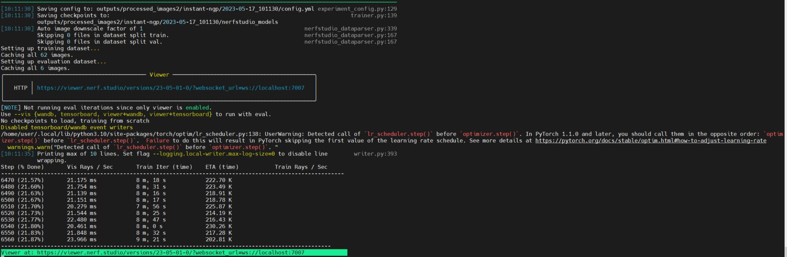

# Insta360数据重建

## Insta360数据处理

insta 360 数据处理，生成相机位姿, ref:[360 Data (Equirectangular)](https://docs.nerf.studio/en/latest/quickstart/custom_dataset.html#data-equirectangular)：

```
ns-process-data images --camera-type equirectangular --images-per-equirect 8 --crop-factor 0.0 0.2 0.utput-dir /workspace/data/insta360/processed_images
```

运行结果如下：

```
utput-dir /workspace/data/insta360/processed_images
[05:20:54] Generating 8 (509, 509) sized images per equirectangular image             images_to_nerfstudio_dataset.py:55
/home/user/.local/lib/python3.10/site-packages/torch/functional.py:504: UserWarning: torch.meshgrid: in an upcoming release, it wil
(Triggered internally at ../aten/src/ATen/native/TensorShape.cpp:3190.)
  return _VF.meshgrid(tensors, **kwargs)  # type: ignore[attr-defined]
Generating Planar Images ━━━━━━━━━━━━━━━━━━━━━━━━━━━━━━━━━━━━━━━━ 100% 12.53 equirect frames/s 00:43
(   ●  ) Copying images...[05:21:43] 🎉 Done copying images.                                                             process_da
[05:27:40] 🎉 Done downscaling images.                                                         process_data_utils.py:364
[05:28:13] 🎉 Done extracting COLMAP features.                                                       colmap_utils.py:137
[05:36:02] 🎉 Done matching COLMAP features.                                                         colmap_utils.py:151
⊙ Running COLMAP bundle adjustment... (This may take a while)
[08:08:56] 🎉 Done COLMAP bundle adjustment.                                                         colmap_utils.py:173
[08:32:42] 🎉 Done refining intrinsics.                                                              colmap_utils.py:182
[08:32:44] 🎉 🎉 🎉 All DONE 🎉 🎉 🎉                                                images_to_nerfstudio_dataset.py:104
           Starting with 4312 images                                                 images_to_nerfstudio_dataset.py:107
           We downsampled the images by 2x, 4x and 8x                                images_to_nerfstudio_dataset.py:107
           Colmap matched 4038 images                                                images_to_nerfstudio_dataset.py:107
           COLMAP found poses for 93.65% of the images.                              images_to_nerfstudio_dataset.py:107

```


**程序运行完，数据输出到`/workspace/data/insta360/processed_images`路径下，之后的3D重建基于此数据。**

<br>


## 普通畸变数据处理

```
ns-process-data images --data /workspace/data/insta360/v7/images/ --output-dir /workspace/data/insta360/v7/processed_images2
```

## 训练

ref: [Train and run viewer](https://docs.nerf.studio/en/latest/quickstart/first_nerf.html#train-and-run-viewer)

```
ns-train instant-ngp --data /workspace/data/insta360/v7/processed_images2/ --viewer.websocket-port 7007
```

运行程序如下：

```
user@e166cd58a880:/workspace$ ns-train instant-ngp --data /workspace/data/insta360/v7/processed_images2/ --viewer.websocket-port 7007
[10:11:30] Using --data alias for --data.pipeline.datamanager.data                                          train.py:222
──────────────────────────────────────────────────────── Config ────────────────────────────────────────────────────────
TrainerConfig(
    _target=<class 'nerfstudio.engine.trainer.Trainer'>,
    output_dir=PosixPath('outputs'),
    method_name='instant-ngp',
    experiment_name=None,
    timestamp='2023-05-17_101130',
    machine=MachineConfig(seed=42, num_gpus=1, num_machines=1, machine_rank=0, dist_url='auto'),
    logging=LoggingConfig(
        relative_log_dir=PosixPath('.'),
        steps_per_log=10,
        max_buffer_size=20,
        local_writer=LocalWriterConfig(
            _target=<class 'nerfstudio.utils.writer.LocalWriter'>,
            enable=True,
            stats_to_track=(
                <EventName.ITER_TRAIN_TIME: 'Train Iter (time)'>,
                <EventName.TRAIN_RAYS_PER_SEC: 'Train Rays / Sec'>,
                <EventName.CURR_TEST_PSNR: 'Test PSNR'>,
                <EventName.VIS_RAYS_PER_SEC: 'Vis Rays / Sec'>,
                <EventName.TEST_RAYS_PER_SEC: 'Test Rays / Sec'>,
                <EventName.ETA: 'ETA (time)'>
            ),
            max_log_size=10
        ),
        profiler='basic'
    ),
    viewer=ViewerConfig(
        relative_log_filename='viewer_log_filename.txt',
        websocket_port=7007,
        websocket_port_default=7007,
        websocket_host='0.0.0.0',
        num_rays_per_chunk=4096,
        max_num_display_images=512,
        quit_on_train_completion=False,
        image_format='jpeg',
        jpeg_quality=90
    ),
    pipeline=DynamicBatchPipelineConfig(
        _target=<class 'nerfstudio.pipelines.dynamic_batch.DynamicBatchPipeline'>,
        datamanager=VanillaDataManagerConfig(
            _target=<class 'nerfstudio.data.datamanagers.base_datamanager.VanillaDataManager'>,
            data=PosixPath('/workspace/data/insta360/v7/processed_images2'),
            camera_optimizer=CameraOptimizerConfig(
                _target=<class 'nerfstudio.cameras.camera_optimizers.CameraOptimizer'>,
                mode='off',
                position_noise_std=0.0,
                orientation_noise_std=0.0,
                optimizer=AdamOptimizerConfig(
                    _target=<class 'torch.optim.adam.Adam'>,
                    lr=0.0006,
                    eps=1e-15,
                    max_norm=None,
                    weight_decay=0
                ),
                scheduler=ExponentialDecaySchedulerConfig(
                    _target=<class 'nerfstudio.engine.schedulers.ExponentialDecayScheduler'>,
                    lr_pre_warmup=1e-08,
                    lr_final=None,
                    warmup_steps=0,
                    max_steps=10000,
                    ramp='cosine'
                ),
                param_group='camera_opt'
            ),
            dataparser=NerfstudioDataParserConfig(
                _target=<class 'nerfstudio.data.dataparsers.nerfstudio_dataparser.Nerfstudio'>,
                data=PosixPath('.'),
                scale_factor=1.0,
                downscale_factor=None,
                scene_scale=1.0,
                orientation_method='up',
                center_method='poses',
                auto_scale_poses=True,
                train_split_fraction=0.9,
                depth_unit_scale_factor=0.001
            ),
            train_num_rays_per_batch=4096,
            train_num_images_to_sample_from=-1,
            train_num_times_to_repeat_images=-1,
            eval_num_rays_per_batch=4096,
            eval_num_images_to_sample_from=-1,
            eval_num_times_to_repeat_images=-1,
            eval_image_indices=(0,),
            camera_res_scale_factor=1.0,
            patch_size=1
        ),
        model=InstantNGPModelConfig(
            _target=<class 'nerfstudio.models.instant_ngp.NGPModel'>,
            enable_collider=False,
            collider_params=None,
            loss_coefficients={'rgb_loss_coarse': 1.0, 'rgb_loss_fine': 1.0},
            eval_num_rays_per_chunk=8192,
            grid_resolution=128,
            grid_levels=4,
            max_res=2048,
            log2_hashmap_size=19,
            alpha_thre=0.01,
            cone_angle=0.004,
            render_step_size=None,
            near_plane=0.05,
            far_plane=1000.0,
            use_appearance_embedding=False,
            background_color='random',
            disable_scene_contraction=False
        ),
        target_num_samples=262144,
        max_num_samples_per_ray=1024
    ),
    optimizers={
        'fields': {
            'optimizer': AdamOptimizerConfig(
                _target=<class 'torch.optim.adam.Adam'>,
                lr=0.01,
                eps=1e-15,
                max_norm=None,
                weight_decay=0
            ),
            'scheduler': ExponentialDecaySchedulerConfig(
                _target=<class 'nerfstudio.engine.schedulers.ExponentialDecayScheduler'>,
                lr_pre_warmup=1e-08,
                lr_final=0.0001,
                warmup_steps=0,
                max_steps=200000,
                ramp='cosine'
            )
        }
    },
    vis='viewer',
    data=PosixPath('/workspace/data/insta360/v7/processed_images2'),
    relative_model_dir=PosixPath('nerfstudio_models'),
    steps_per_save=2000,
    steps_per_eval_batch=500,
    steps_per_eval_image=500,
    steps_per_eval_all_images=25000,
    max_num_iterations=30000,
    mixed_precision=True,
    use_grad_scaler=False,
    save_only_latest_checkpoint=True,
    load_dir=None,
    load_step=None,
    load_config=None,
    log_gradients=False
)
────────────────────────────────────────────────────────────────────────────────────────────────────────────────────────
[10:11:30] Saving config to: outputs/processed_images2/instant-ngp/2023-05-17_101130/config.yml experiment_config.py:129
[10:11:30] Saving checkpoints to:                                                                         trainer.py:139
           outputs/processed_images2/instant-ngp/2023-05-17_101130/nerfstudio_models
[10:11:30] Auto image downscale factor of 1                                                 nerfstudio_dataparser.py:339
           Skipping 0 files in dataset split train.                                         nerfstudio_dataparser.py:167
           Skipping 0 files in dataset split val.                                           nerfstudio_dataparser.py:167
Setting up training dataset...
Caching all 62 images.
Setting up evaluation dataset...
Caching all 6 images.
╭─────────────────────────────────────────── Viewer ───────────────────────────────────────────╮
│        ╷                                                                                     │
│   HTTP │ https://viewer.nerf.studio/versions/23-05-01-0/?websocket_url=ws://localhost:7007   │
│        ╵                                                                                     │
╰──────────────────────────────────────────────────────────────────────────────────────────────╯
[NOTE] Not running eval iterations since only viewer is enabled.
Use --vis {wandb, tensorboard, viewer+wandb, viewer+tensorboard} to run with eval.
No checkpoints to load, training from scratch
Disabled tensorboard/wandb event writers
/home/user/.local/lib/python3.10/site-packages/torch/optim/lr_scheduler.py:138: UserWarning: Detected call of `lr_scheduler.step()` before `optimizer.step()`. In PyTorch 1.1.0 and later, you should call them in the opposite order: `optimizer.step()` before `lr_scheduler.step()`.  Failure to do this will result in PyTorch skipping the first value of the learning rate schedule. See more details at https://pytorch.org/docs/stable/optim.html#how-to-adjust-learning-rate
  warnings.warn("Detected call of `lr_scheduler.step()` before `optimizer.step()`. "
[10:11:35] Printing max of 10 lines. Set flag --logging.local-writer.max-log-size=0 to disable line        writer.py:393
           wrapping.
Step (% Done)       Vis Rays / Sec       Train Iter (time)    ETA (time)           Train Rays / Sec
--------------------------------------------------------------------------------------------------------
450 (1.50%)         20.050 ms            9 m, 52 s            224.00 K
460 (1.53%)         18.313 ms            9 m, 0 s             239.66 K
470 (1.57%)         18.235 ms            8 m, 58 s            240.23 K
480 (1.60%)         20.577 ms            10 m, 7 s            218.10 K
490 (1.63%)         20.825 ms            10 m, 14 s           213.87 K
500 (1.67%)         18.258 ms            8 m, 58 s            241.30 K
510 (1.70%)         16.758 ms            8 m, 14 s            256.41 K
520 (1.73%)         18.880 ms            9 m, 16 s            234.55 K
530 (1.77%)         20.921 ms            10 m, 16 s           220.49 K
531 (1.77%)         396.84 K             21.255 ms            10 m, 26 s           216.20 K
----------------------------------------------------------------------------------------------------
Viewer at: https://viewer.nerf.studio/versions/23-05-01-0/?websocket_url=ws://localhost:7007


```



本地浏览器可以通过网页连接远程的服务器，查看重建情况：

我们先构建本地机器和远程服务器的链接，ref:[Training on a remote machine](https://docs.nerf.studio/en/latest/quickstart/viewer_quickstart.html#training-on-a-remote-machine)

**如下的命令，现在本地开启一个终端，执行：`<username>@<remote-machine-ip>`替换成用户自己的`用户名`和`ip`,这一步一定要先执行。**

```
ssh -L 7007:localhost:7007 <username>@<remote-machine-ip>
```

然后，在本地浏览器输入：`https://viewer.nerf.studio/versions/23-05-01-0/?websocket_url=ws://localhost:7007`，查看重建情况。

